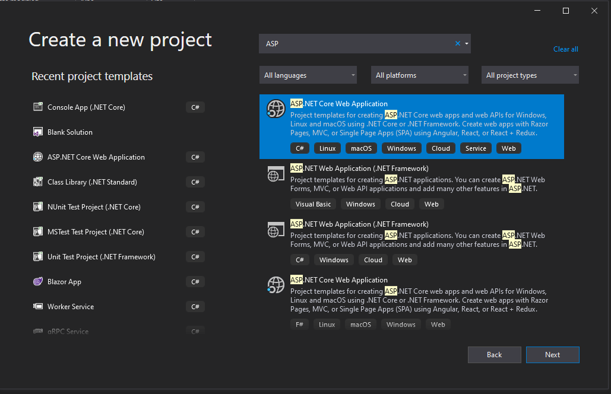
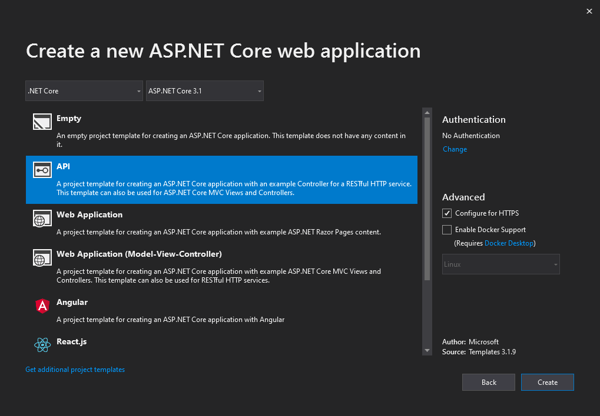
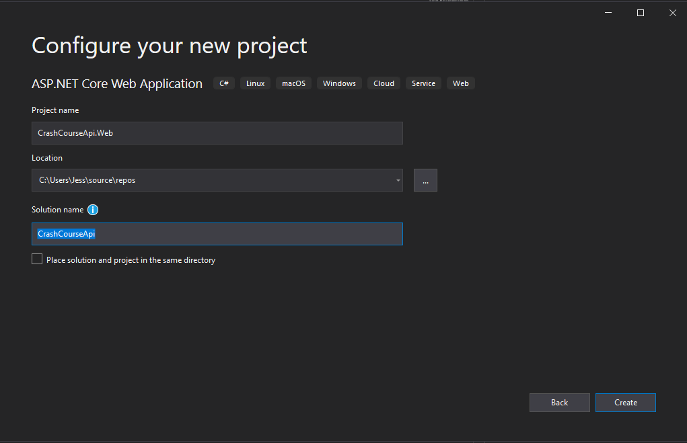
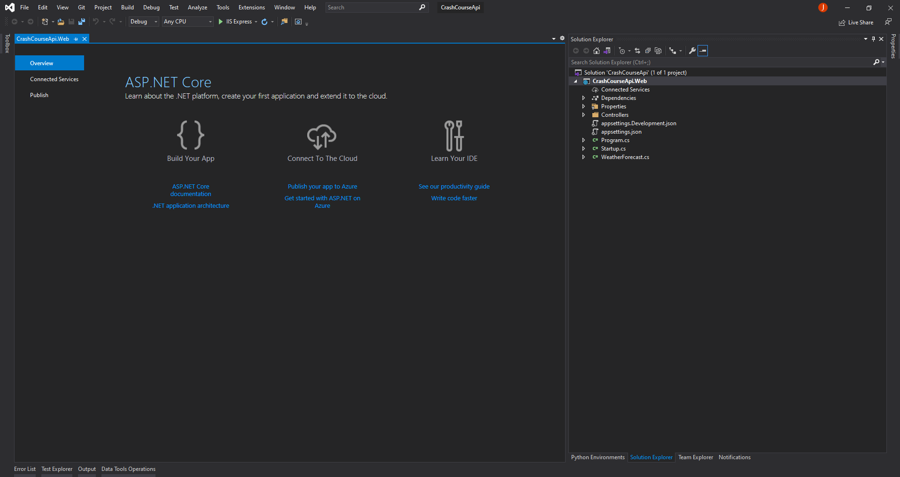
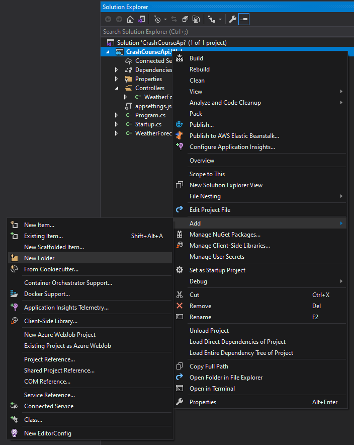
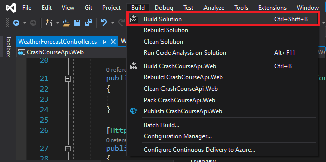
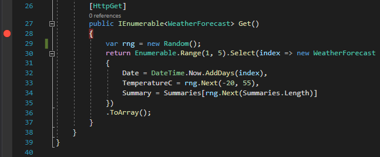
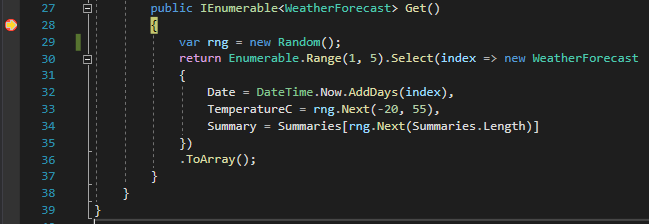

#  Lesson 1: Creation of an API using Visual Studio 2019 Template

Visual Studio 2019 (VS) is an IDE (Integrated development environment) and an essential tool in the life of the developer. It is designed to make your life easy and fast. Very fast. 

**Step 1**: Run VS and create a new project:


**Step 2**: Search for "ASP.NET Core Web Application" project type then Next:



A note about the name of the project type: 
* "ASP.NET" is a framework (put simple, it is a set of librairies, although they have their differences) that helps you builds Web Application. ASP.NET is built on top of .NET Framework. 
* "ASP.NET Core" is also a web framework but based on .NET Core, which has been designed for running on multiple platforms. This removed the need to use Windows and IIS to run your code. .NET Core is quite popular for many reasons. Hence the choice for this project.

**Step 3**: Name the project and Create



**Step 4**: Select the "API" template 



A template helps you to get started. A lot of APIs shared the same structure. Template avoids re-inventing the wheel for every APIs. You can create your own VS Templates to encourage your company's standards (eg. logging strategy, authorization/authentication mechanism,...).

When clicking "Create", you should have the following screen appearing:



**Step 5**: Clean files

The solution explorer shows the file generated as part of the template. 


First, our newly project is under a Solution (.sln). A VS Solution can contains several projects, that can be dependent or independent of each other. We will keep a single project for this course, so no need to worry about this. 

**Properties/launchSettings.json** is a configuration file. It tells how you want to run your application. If you check the content of the file, you will notice two "profiles": one for IIS, the other one named after the project. We can remove the IIS config and keep only the following code:

```json
{
  "profiles": {
    "CrashCourseApi.Web": {
      "commandName": "Project",
      "launchBrowser": true,
      "launchUrl": "weatherforecast",
      "applicationUrl": "https://localhost:5001;http://localhost:5000",
      "environmentVariables": {
        "ASPNETCORE_ENVIRONMENT": "Development"
      }
    }
  }
}
```

**appsettings.*.json** are configuration files. They contains application configurations, that can be different from one environment to the other. Hence the appSettings.Development.json file. We will modify the appSettings.json file only as part of this course so you can ignore and delete the appsettings.Development.json file. 

**Program.cs**: The Program.cs contains the main method, and this is the default entrypoint of every console application. Without it, your application would not know where to start the program.  

CRTL, R + G to clean the namespaces at the top of the file: 
```csharp
using Microsoft.AspNetCore.Hosting;
using Microsoft.Extensions.Hosting;
```
These are references to location inside the .NET Core libraries. When you need to call a method from the .NET Core or any libraries, you need to specify its namespaces. 

Now, take a glance at the content of the file. I mentioned previously that IIS is not required to run the code, the reason is that the application is self-hosted. That came nicely with the "Core" of ASP.NET Core framework. This is particularly useful when deploying the code somewhere else: IIS and Windows are not a requirement anymore to run .NET web apps. 

```csharp
public static IHostBuilder CreateHostBuilder(string[] args) =>
    Host.CreateDefaultBuilder(args)
        .ConfigureWebHostDefaults(webBuilder =>
        {
            webBuilder.UseStartup<Startup>();
        });
```

Not so many changes will happen in this file. 

**Startup.cs**: This file configures services and the app's request pipeline. Its called Startup.cs by convention. We will come back to the `ConfigureServices` method later in the course, when talking about DI. `Configure` method defines behaviors to apply when new HTTP request are coming and is essential for our web API (incl. routing of endpoints). 

Keep CRTL, R + G to clean the namespaces.

Before looking at the two last "WeatherForecast" files, Right click on the project to Add a new "Models" folder.



Then drag the WeatherForecast.cs file under Models folder. 

In the `WeatherForecast.cs` file, replace `CrashCourseApi.Web` namespace by `CrashCourseApi.Web.Models`. 
In the `WeatherForecastController.cs` file, add `using CrashCourseApi.Web.Models;`. Then CRTL, R + G.

These two files are examples provided as part of the template. We will be extending these files to include new features. Before going into the details of each, we will build and run the API. 

**Step 6**: Compile

C# is a compiled language. A compiler will convert the high level code (C# here) into Code Machine (eg. EXE or DLL), while an interpreter language (such as Python) would convert it when it is run (hence no intermediate file). 

This extra step allows to detect right away syntax issues, instead of waiting for your code through the issues and crash. The compiler is your best friend as you start your journey as a dev: runtime errors are way harder to detect. 

If by now, you added an extra-character unvoluntarily in the code, the compiler will tell you as soon as you build. 


To Build, Build menu > Build Solution, but you better use the shortcut from now.



If no syntax issue, then you are good to run. 

**Step 7**: Run

To Run, Click on the button or F5 key:


If all is well, a console has started and the browser has launched. 


**Step 8**: Debug

Without stopping the code, go back to `WeatherForecastController.cs` and add a breakpoint by clicking in the side of the project:



Now back to the browser and refresh the page (F5). 



In your application, you should see a yellow arrow. In Debug mode, you can stop the mid-execution to "watch" the value your variables as you go one line after the other, or one breakpoint after the other. The most useful shortcuts: 
* **F10** to go to the next line
* **F11** to step into a function
* **F5** to go to next breakpoint or complete execution if no more breakpoint

Click again on the breakpoint to remove it. 

**Step 9**: Use it

What you see in the browser, is the result of your WeatherForecast endpoint. Since there is only one endpoint, it is the default page (defined in the launchSettings file, "launchUrl" property).

You can use a curl command to access the endpoint:

```bash
curl -X GET https://localhost:5001/weatherforecast
```

Or feel free to use Postman to run the queries. 

**Step 10**: CRTL-C in the console application and Enter to stop it 


