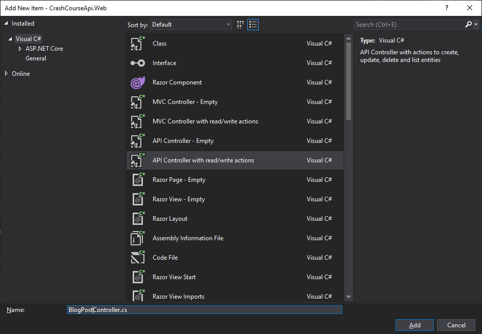

#  Lesson 2: Creation of a REST API controller

## Description of WeatherForecastController class

Before going to the main topic of this lesson, let's have a look at the WeatherForecast code of the previous lesson. 

Go to `WeatherForecastController.cs`. 
The ASP.NET Core framework provides you with many libraries and foundations for building code. 
For instance, the `WeatherForecastController` below defines an endpoint for your API, while removing a lot of complexity of managing HTTP Requests and Responses. What makes this C# class an API controller is the following information:

```csharp
[ApiController]
[Route("[controller]")]
public class WeatherForecastController : ControllerBase
{
    // [...]
}
```

* `[ApiController]` and `[Route("[controller]")]` are called attributes. Attributes associate metadata to a class, information. Here these attributes are used by the ASP.NET Framework to "API Controllers" behaviors to our code. 
    - ApiController is used by the framework to detect the list of available endpoints accross the project. 
    - Route is used to build a routing table. If you remember well, our API endpoint was called using `https://localhost:5001/weatherforecast`, the `weatherforecast` is coming from this `[controller]`: which is the name of the controller in lowercase. This is a standard way of doing, you can override this value.
* `ControllerBase` is the base class and contains generic methods and properties that would be common to all our API controllers. For instance, this would help you build easily HTTP Responses.

This is a glimpse of `ControllerBase` content: 


The next bit of code that interest us in the context of API Controller is this one: 

```csharp
[HttpGet]
public IEnumerable<WeatherForecast> Get()
{
    // ...
}
```

This defines a GET endpoint. When we called our endpoint through CURL, we use the GET HTTP Method.

```
curl -X GET https://localhost:5001/weatherforecast
```

* The `[HttpGet]` method attribute is telling ASP.NET Core that this specific C# method is an endpoint to expose and make available for HTTP Requests. 
* The return type of this method is an `IEnumerable<WeatherForecast>`: which is a list of objects of type "WeatherForecast" (we define its class, in our Models/ folder). Put simple, when the list of objects is returned by this method, the framework will convert it into in a JSON object and wrap it under an HTTP Response. This is why you will have this results displayed when running the CURL command (or in the browser). If you pay attention to the models/WeatherForecast.cs, you will see similarities on the properties displayed. 

```json
[
  {
    "date":"2021-01-13T08:24:34.7359833+00:00",
    "temperatureC":36,
    "temperatureF":96,
    "summary":"Warm"
  },
  {
    "date":"2021-01-14T08:24:34.7363396+00:00",
    "temperatureC":0,
    "temperatureF":32,
    "summary":"Sweltering"
  },
  ...
]
```

Finally, you might have recognized the constructor of the `WeatherForecastController` and the `ILogger` field. We will come to the structure of the constructor in a next lesson. 

```csharp
public WeatherForecastController(...)
{
    // ...
}
```

Now it is time to take a deep dive into REST API. 

## REST Foundations

There are lots of documentation on the Internet for this that would explain it a lot better, but to keep it short, REST API is a software architectural style to define Web Services in a structured manner. The main idea was to reuse the foundation of HTTP Methods (GET, PUT, POST, DELETE) defined by the HTTP protocol, to describe an API is an easy way. This was also in an effort of designing less complicated web services. Often, an API's job would be to do a certain number of operations such as reading data from a table (or SQL entity) in a database, inserting a row, updating a row using its ID, deleting a row.

| Operations | SQL Operation | HTTP Method |
|---|---|---|
| **C**reate | `INSERT INTO <table> VALUES (...)`  | POST |
| **R**ead | `SELECT * FROM <table>` | GET |
| **U**pdate | `UPDATE <table> SET <prop>=<newval> ...`  | PUT |
| **D**elete | `DELETE FROM <table> ...`  | DELETE |

So, if we have a table `BlogPost`
| Id | Title | Content | DateCreation | Author | Category |
|----|-------|---------|--------------|--------|----------|
| 1  | Best practices for writing C# code | Long content 1 | 12/01/2021 | John Smith | Software Development | 
| 2  | How to design a distributed system properly | Long content 2 | 11/01/2021 | Paul Michou | Architecture | 

And you wish to create an API on top to create easily new BlogPost, you would create an `blogpost` GET, POST, PUT, DELETE endpoints that can be called to manage (read, create, update, delete) the entries in your database. 

## Create a new controller

**Step 1**: Create an API controller

Back to the solution, we can create a Controller by right clicking on the Controllers folder and Add Controller:


Choose the "API Controller with read/write actions":


Then name it `BlogPostController.cs`:


After adding the controller, some base code will be generated for you, but this time, there will be one for each HTTP Method as well as two GET Methods. 

The route attribute now shows `/api/[controller]` for this controller: something to keep in mind when calling the API later. We will keep this naming convention here. 

**Step 2**: Create a "response" class & update GET methods

Create a new class in the models/ folder (use the VS menu), called BlogPostResponse.cs.

Add the following properties:
* Id is of type `int` (integer): positive or negative number.
* Title and Content are "string": some plain text
* CreationDate will be the UTC date and time when we create a blog post. 

```csharp 
namespace CrashCourseApi.Web.Models
{
    public class BlogPostResponse
    {
        public int Id { get; set; }
        public string Title { get; set; }
        public string Content { get; set; }
        public DateTime CreationDate { get; set; }
    }
}
```

Back to the controller, replace the list of strings by a list of BlogPost objects (incl. the missing namespace):
```csharp
[HttpGet]
public IEnumerable<BlogPostResponse> Get()
{
    return new BlogPostResponse[] { 
        new BlogPostResponse()
        {
            Id = 1,
            Title = "Best practices for writing C# code",
            Content = "Blah",
            CreationDate = new System.DateTime(2021, 1, 11)
        },
        new BlogPostResponse()
        {
            Id = 2,
            Title = "How to design a distributed system properly",
            Content = "Blah",
            CreationDate = new System.DateTime(2021, 1, 12)
        }
    };
}
```

Looking at the next GET endpoint, `Get(int id)`, what would be good is to actually return the right items in this list that we defined. 
To do this, we will create a static variable in our controller to contain the list (similarly than "summaries" in the )

```csharp
private static readonly BlogPostResponse[] blogPosts = new BlogPostResponse[] {
  ...
}
```

Then replace the content of the GET list too:

```csharp
[HttpGet]
public IEnumerable<BlogPostResponse> Get()
{
    return blogPosts;
}
```

Now, for the Get by ID implementation (System.Linq namespace):
```csharp
[HttpGet("{id}")]
public BlogPostResponse Get(int id)
{
    return blogPosts.SingleOrDefault(x => x.Id == id);
}
```
Linq is a powerful library to manipulate list of objects, we will use it extensively. `SingleOrDefault` method will return the object of your list matching the ID. If it can't find any, null is returned. If it finds more than one, it will throw an exception. 

If you run the application now, you can access to the endpoints by calling

```bash
# Get All 
curl -X GET https://localhost:5001/api/blogpost

# Get by ID
curl -X GET https://localhost:5001/api/blogpost/1 

# Get by ID (not found)
curl -X GET https://localhost:5001/api/blogpost/3
```

Let's stop the application and create the POST endpoint to create a new item in the list. 

**Step 3**: Create a "request" class & update POST method

Few considerations before we start:
* When we create a new blog post, we would like the CreationDate to be populated for us instead of entering it manually
* In our system, we use the ID to identify our blog post, so this info should be unique. We will need to throw an error is the ID already exist, alternatively, we can generate this info. 
* Without this two information, we have a different data model that we pass in request. As a result, we will create a new BlogPostRequest model, that will use in the Post method:

```csharp
public class BlogPostRequest
{
    public string Title { get; set; }
    public string Content { get; set; }
}
```

```csharp
[HttpPost]
public void Post([FromBody] BlogPostRequest value)
{

}
```

The FromBody Attribute means that the data will be retrieved from the Body of the HTTP Request. Data can be sent to the server via URL parameters, Headers or Body. The number of URL parameters is limited to a certain number of characters. The Headers are usually describing how the HTTP request is being handled (Authorization header, Content-Type...). The Body will be encrypted when using HTTPs, can be of several content type (such as JSON) and not really limited in size.

Add a breakpoint to your POST method and run your application:

```bash
# Create (do nothing for now)
curl -k -X POST https://localhost:5001/api/blogpost -H "Content-Type: application/json" --data "{\"title\":\"my title\",\"content\":\"my content\"}"
```


Stop the application again.

Adding items to blogPosts is easiest if a list is used, rather than an array, so we will be changing the type: 

```csharp
private static readonly List<BlogPostResponse> blogPosts = new List<BlogPostResponse> {...}
```

And update the POST method:
* We are going to create a new object in the list based on the info available in the request (Title and Content). 
* For ID, we will take the maximum ID of the list and add 1 (to auto-generate it)
* For CreationDate, we will use DateTime.UtcNow.
* List<T> of objects allows you to add new object easily. 

```csharp
[HttpPost]
public void Post([FromBody] BlogPostRequest value)
{
    var blogPost = new BlogPostResponse()
    {
        Id = blogPosts.Max(x => x.Id) + 1,
        Title = value.Title,
        Content = value.Content,
        CreationDate = DateTime.UtcNow
    };

    blogPosts.Add(blogPost);
}
```

Run the application 

```bash
# Create (do nothing for now)
curl -k -X POST https://localhost:5001/api/blogpost -H "Content-Type: application/json" --data "{\"title\":\"my title\",\"content\":\"my content\"}"

# Then get your newly created item
curl -X GET https://localhost:5001/api/blogpost/3
```

The list of BlogPost is currently stored in-memory. If the application is restarted, your added item will not be in the list, only the 2 first ones, statically defined in code. We will need to persist the data into a database to keep them. But first, let's finish the 2 other methods. 

**Step 4**: Update a blog post

Update the Put method: 
* search in the list of blogPost the right ID
* if found, update title and content properties

```csharp
[HttpPut("{id}")]
public void Put(int id, [FromBody] BlogPostRequest value)
{
    var blogPost = blogPosts.SingleOrDefault(x => x.Id == id);
    if (blogPost != null)
    {
        blogPost.Title = value.Title;
        blogPost.Content = value.Content;
    }
}
```

Then run and test:

```bash
# Update the title and content:
curl -k -X PUT https://localhost:5001/api/blogpost/2 -H "Content-Type: application/json" --data "{\"title\":\"new title\",\"content\":\"new content\"}"

# Get your update item:
curl -X GET https://localhost:5001/api/blogpost/2
```

**Step 5**: Remove a blog post

Update the Delete method: 
* search in the list of blogPost the right ID
* if found, remove it from the list

```csharp
[HttpDelete("{id}")]
public void Delete(int id)
{
    var blogPost = blogPosts.SingleOrDefault(x => x.Id == id);
    if (blogPost != null)
    {
        blogPosts.Remove(blogPost);
    }
}
```

Then run and test:

```bash
# Remove the blog post by ID
curl -k -X DELETE https://localhost:5001/api/blogpost/2 

# Get the list to check it disappeared
curl -X GET https://localhost:5001/api/blogpost
```

And this concludes Lesson 2. Next Lesson, we will be persisting the BlogPost into a relational database (using docker for SQL Server).

