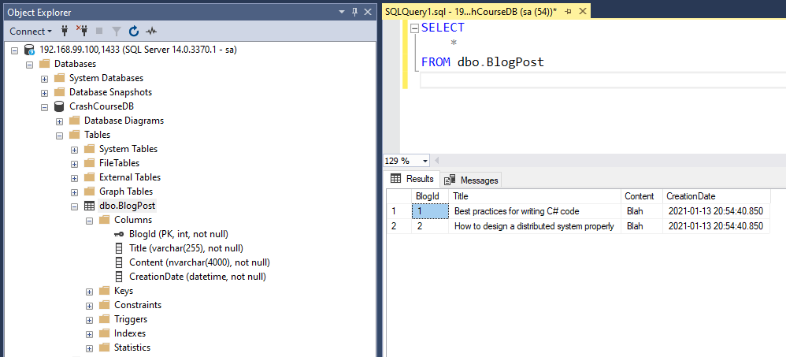
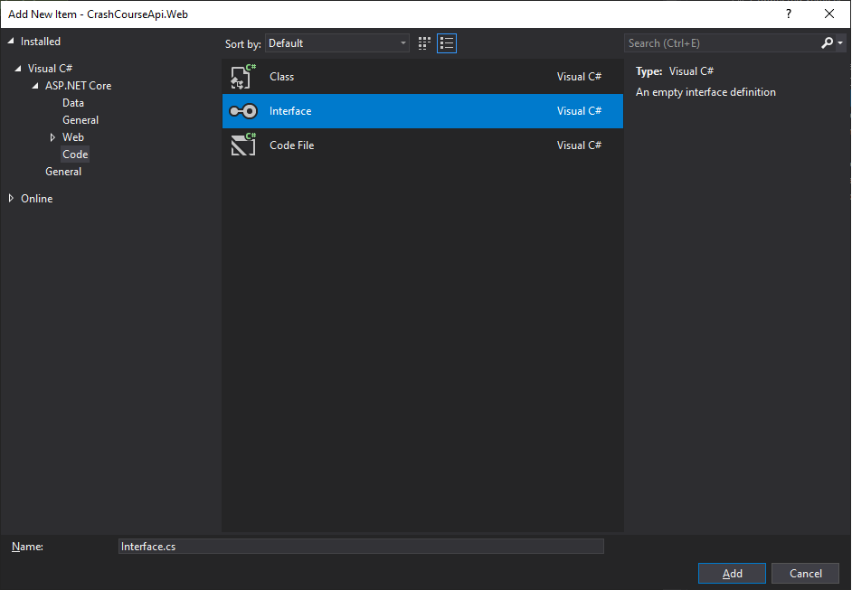
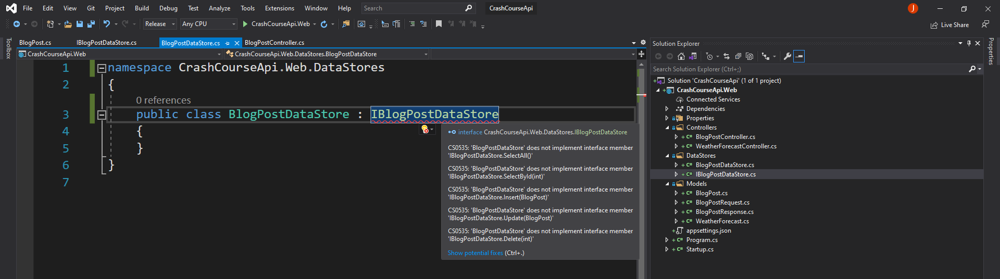
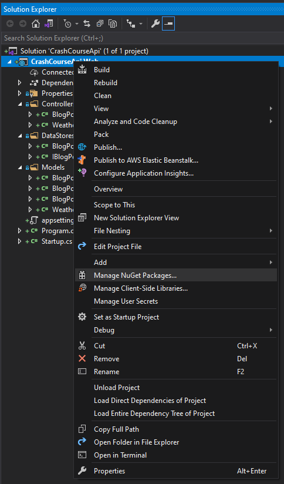
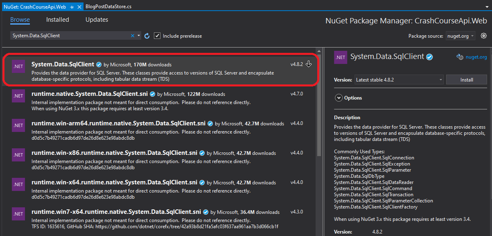

# Lesson 3: Storing data in a relational database and Data Access Layer

In the previous lesson, we created a BlogPost API controller with read, create, update and remove blog post of a in-memory list, wiped when the service is stopped. Our next step is to persist the blog post into a database. 

When choosing a data storage for an API, we often choose among the two major data models: RDBMS (Relational Database Management System) or NoSQL. For this lesson, we will use a relational DB as they bring interesting concepts to learn (eg. ORM) and are very much in use. That said, we will write the code so the Data Access Layer (DAL) can be modified later. 

To simulate a database server, we will use a docker image of SQL Server. The base is extended to include the initial SQL scripts. We use a `docker-compose.yml` just to simplify the build the image and run the container. Docker, as well as SQL Server, can be the topics of separated courses so we won't go into much details here. 

**Step 1**: Start your local DB server

Go to the ./Prep folder and in a console, run the following command: 
```
docker-compose up
```

As part of the initial scripts, we create a database called `CrashCourseDB`, then we create a table BlogPost that looks like this:
```sql
CREATE TABLE BlogPost (
    BlogId INT NOT NULL IDENTITY(1,1),
    Title VARCHAR(255) NOT NULL,
    Content NVARCHAR(4000) NOT NULL,
    CreationDate DATETIME NOT NULL
    PRIMARY KEY (BlogId)
);
```

We also insert the two rows:
```sql
INSERT INTO dbo.BlogPost 
VALUES 
('Best practices for writing C# code', 'Blah', GETUTCDATE()),
('How to design a distributed system properly', 'Blah', GETUTCDATE())
```

If you have SQL Server Management Studio (SSMS) installed, go to: 
* Server: `localhost,1433`
* Username: `sa`
* Password: `VerySecret1234`

The results should look like:


Our database is now ready. 

**Step 2**: Preparing the DAL 

So far, the code written in the `BlogPostController.cs` class was minimal. Writing code for connecting to a database and transforming the data will require a bit more code. I also mentioned that the code should be easily replaced in case we change our mind and go to a NoSQL solution for storing our data. As a best coding practice, we will almost systematically split the DAL code into separate classes. 

As a result, we will fly over some concepts that will be detailed into Lesson 4, such as Dependency Injection (DI).

in "Models", copy the BlogPostResponse class and rename file and class `BlogPost`. 

Next, create a folder `DataStores` in your project.

Create a new item in the `DataStores`, select Interface and call it `IBlogPostDataStore`.



```csharp
namespace CrashCourseApi.Web.DataStores
{
    public interface IBlogPostDataStore
    {
    }
}
```

An interface defines a contract that a class must implement. Interfaces are particularly useful when it comes to DI.

Create a new item in the `DataStores`, select Class and call it `BlogPostDataStore`. Then implements the interface `IBlogPostDataStore` in the `BlogPostDataStore` class.

```csharp
namespace CrashCourseApi.Web.DataStores
{
    public class BlogPostDataStore: IBlogPostDataStore
    {
    }
}
```

In the `BlogPostController.cs`, add:
* a readonly variable of type IBlogPostDataStore
* add a constructor 
* add a `IBlogPostDataStore` parameter 

```csharp
private readonly IBlogPostDataStore _blogPostDataStore;

public BlogPostController(IBlogPostDataStore blogPostDataStore)
{
    _blogPostDataStore = blogPostDataStore;
}
```

In Startup.cs class, add the following code after `services.AddControllers();`:

```csharp
services.AddSingleton<IBlogPostDataStore, BlogPostDataStore>();
```

This will tell your API Controller constructor to **inject** an instance of the class `BlogPostDataStore` (which is unique here, a singleton), whenever it meets the interface `IBlogPostDataStore`.

**Step 4**: Define the contract

Back in the interface, define the following contracts:

```csharp
using CrashCourseApi.Web.Models;
using System.Collections.Generic;

namespace CrashCourseApi.Web.DataStores
{
    public interface IBlogPostDataStore
    {
        IEnumerable<BlogPost> SelectAll();
        BlogPost SelectById(int id);
        void Insert(BlogPost blogPost);
        void Update(BlogPost blogPost);
        void Delete(int id);
    }
}
```

Similarly to the API controller, we have one method per operations. The differences is on the name chosen, I am chosing a more database-friendly terminology.

If we go back to the class now, you will notice that VS isn't specially happy about your class anymore: 



If you follow the instructions and implement the interface, some code will be auto-generated for you. 

**Step 4**: Define a simple SQL Connection & Commands

The .NET Core Framework proposes `System.Data.SqlClient` library, that we will use at the beginning to describe few notions. We will then replace it by the [Dapper](https://github.com/StackExchange/Dapper) library in Step 4.

To install the library, right click on the project, Manage Nuget Packages: 



Then search for `System.Data.SqlClient` and Install (accept the dependencies):



In the `BlogPostDataStore.cs`, we look at the SelectAll method first: 

```csharp
public IEnumerable<BlogPost> SelectAll()
{
    // Create a list of BlogPost
    var blogPosts = new List<BlogPost>();

    // define where to connect and how
    var conn = new SqlConnection("Data Source=localhost,1433;Initial Catalog=CrashCourseDB;User ID=sa;Password=VerySecret1234!");
    
    // open a db connection
    conn.Open();

    // Query the database
    var command = new SqlCommand("Select BlogId, Title, Content, CreationDate from [BlogPost]", conn);

    using (var reader = command.ExecuteReader())
    {
        // for each row read from the SQL SELECT,
        // we create a new BlogPost object
        // and add it to the list of BlogPost
        while (reader.Read())
        {
            var blogPost = new BlogPost()
            {
                Id = reader.GetInt32(0), // 1st column is BlogId
                Title = reader.GetString(1), // 2nd column is Title 
                Content = reader.GetString(2), // 3rd column is Content 
                CreationDate = reader.GetDateTime(3) // 4th column is CreationDate 
            };
            blogPosts.Add(blogPost);
        }
    }

    // close DB connection
    conn.Close();

    // we return the list of BlogPost made of the database records 
    return blogPosts;
}
```

Now that our method is defined, we still need to call it from the ApiController. 

Change the content of the Get() method: 

```csharp
[HttpGet]
public IEnumerable<BlogPostResponse> Get()
{
    // Call our datastore method
    var blogPostEntities = _blogPostDataStore.SelectAll();

    // Map BlogPost objects to BlogPostResponse objects
    return blogPostEntities.Select(x => new BlogPostResponse() {
        Id = x.Id, 
        Title = x.Title,
        Content = x.Content,
        CreationDate = x.CreationDate
    });
}
```

We can build and run the application to test the access to the database

```
curl -X GET https://localhost:5001/api/blogpost
```

**Step 5**: Code refactoring

Two improvements can be done to this code before we carry on the features.. We are going:
* to use an ORM to simplify the code
* to move the connection strings to the appSettings (environment specific variable)

[Dapper ORM Library](https://github.com/StackExchange/Dapper) is an abstraction of the [System.Data.SqlClient.SqlConnection](https://docs.microsoft.com/en-us/dotnet/api/system.data.sqlclient.sqlconnection?view=dotnet-plat-ext-5.0&viewFallbackFrom=netcore-3.1). ORM stands for Object-relational mapping and is used to map C# Classes and SQL Entities. 

In Oriented Object Programming (OOP), an abstraction handles the complexity of a class or library by hiding unnecessary details from the developer.

C# Classes and SQL Entities can differ in format, for instance, the identifier of our BlogPost class is called `Id` while the SQL Table defines it as `BlogPostId`. There could be also some differences between the C# types (eg. double) and SQL types (eg. DECIMAL(18,5)). If different team owns the application and the database, you will end up with more than a few differences, each might follow their own standards. The "mapping" can become more complex in this situation. This is common practice to use an ORM to avoid writing a lot of mapping of code. Dapper is one. The Microsoft's favorite is its EntityFramework. NHibernate was quite popular few years back too. 

To start using Dapper, add the nuget package `Dapper`. 

In the `BlogPostDataStore.cs`, we look another look at the SelectAll method first: 

```csharp
public IEnumerable<BlogPost> SelectAll()
{
    // declare the list of BlogPost
    IEnumerable<BlogPost> blogPosts = null;

    // using {} will be in charge of opening, closing and disposing the transaction
    using (var conn = new SqlConnection("Data Source=localhost,1433;Initial Catalog=CrashCourseDB;User ID=sa;Password=VerySecret1234!"))
    {
        // Query the database
        // for each row read from the SQL SELECT,
        // new BlogPost object
        // and the final list of BlogPost is return by the Query function
        blogPosts = conn.Query<BlogPost>("Select BlogPostId as Id, Title, Content, CreationDate from [BlogPost]").AsList();

        // explicitly closing
        conn.Close();
    }
    return blogPosts;
}
```

We can build and run the application to test the access to the database.

```
curl -X GET https://localhost:5001/api/blogpost
```

Before we update the other endpoints, let's fix this connection string.

```
Data Source=localhost,1433;Initial Catalog=CrashCourseDB;User ID=sa;Password=VerySecret1234!
```

Right now, the DB connection string is hard-coded: if we need to change the connection string to point to another server, we have to change the code. Instead of defining it in code, we are going to move this to the appSettings file. These connection strings can then be overriden just before deploying onto a production environment. Another reason of not hard-coding it and to define it just before deploying, is that connection string could contain sensitive information such as passwords, and this can never end up into a source control system (such as git).

In order to pass this configuration into the BlogPostDataStore, we have to do a couple of changes. 

First, add the following configuration to the appSettings:

```json
"ConnectionStrings": {
    "CrashCourseDb": "Data Source=localhost,1433;Initial Catalog=CrashCourseDB;User ID=sa;Password=VerySecret1234!"
},
```

Second, update the constructor of BlogPostDataStore to use IConfiguration and set a _connectionString variable. By setting it on the constructor, the variable will be initialized only once when the singleton is created. 

```csharp
private readonly string _connectionString;

public BlogPostDataStore(IConfiguration configuration)
{
    _connectionString = configuration.GetConnectionString("CrashCourseDb");
} 
```

Finally, update the SqlConnection object:

```csharp
new SqlConnection(_connectionString)
```

**Step 6**: Writing the 4 other datastores

**Get Blog Post By Id**:

In datastore:

```csharp
public BlogPost SelectById(int id)
{
    BlogPost blogPost = null;
    using (var conn = new SqlConnection(_connectionString))
    {
        // Select a blogPost which parameter = id
        // If it does not exist, return null.
        blogPost = conn.QuerySingleOrDefault<BlogPost>("Select BlogPostId as Id, Title, Content, CreationDate from [BlogPost] where BlogPostId = @Id", new { Id = id });

        conn.Close();
    }
    return blogPost;
}
```

In controller:

```csharp
[HttpGet("{id}")]
public BlogPostResponse Get(int id)
{
    // Call the datastore
    var blogPostEntity = _blogPostDataStore.SelectById(id);

    // if the item does not exist, just return "null" 
    if (blogPostEntity == null)
    {
        return null;
    }    

    // if item exists, transform it into a reponse object
    return new BlogPostResponse()
    {
        Id = blogPostEntity.Id,
        Title = blogPostEntity.Title,
        Content = blogPostEntity.Content,
        CreationDate = blogPostEntity.CreationDate
    };
}
```

Build, Run and Test:
```
curl -X GET https://localhost:5001/api/blogpost/1 -- exists
curl -X GET https://localhost:5001/api/blogpost/3 -- does not exist
```

**Create new Blog Post**:

In datastore:

```csharp
public void Insert(BlogPost blogPost)
{
    using (var conn = new SqlConnection(_connectionString))
    {
        // BlogPostId will be autogenerated (IDENTITY column)
        // The 3 parameters @Title, @Content, @CreationDate matches perfectly the properties in BlogPost object so we don't need to specific anything else

        conn.Execute("INSERT INTO BlogPost (Title, Content, CreationDate) VALUES (@Title, @Content, @CreationDate)", blogPost);
        conn.Close();
    }
}
```

In controller:

```csharp
[HttpPost]
public void Post([FromBody] BlogPostRequest value)
{
    // Not need to specify ID (blogPosts.Max(x => x.Id) + 1), DB will autogenerate the ID for you.

    var blogPost = new BlogPost() {
        Title = value.Title,
        Content = value.Content,
        CreationDate = DateTime.UtcNow
    };

    _blogPostDataStore.Insert(blogPost);
}
```

Build, Run and Test:

```bash
curl -k -X POST https://localhost:5001/api/blogpost -H "Content-Type: application/json" --data "{\"title\":\"my title\",\"content\":\"my content\"}"
curl -k -X GET https://localhost:5001/api/blogpost  # to test the insertion
```

**Update an existing Blog Post**:

In datastore:

```csharp
public void Update(BlogPost blogPost)
{
    using (var conn = new SqlConnection(_connectionString))
    {
        // The two properties to update Title and Content are matching the properties in blogPost
        // And so is Id for identifying which record to update
        conn.Execute("UPDATE BlogPost SET Title = @Title, Content = @Content WHERE BlogPostId = @Id", blogPost);

        conn.Close();
    }
}
```

In controller:

```csharp
[HttpPut("{id}")]
public void Put(int id, [FromBody] BlogPostRequest value)
{
    var blogPost = new BlogPost()
    {
        Id = id,
        Title = value.Title,
        Content = value.Content
    };
    _blogPostDataStore.Update(blogPost);
}
```

Build, Run and Test:

```bash
curl -k -X PUT https://localhost:5001/api/blogpost/2 -H "Content-Type: application/json" --data "{\"title\":\"new title\",\"content\":\"new content\"}"
curl -k -X GET https://localhost:5001/api/blogpost/2  # to test the update
```

**Delete a Blog Post**:

In datastore:

```csharp
public void Delete(int id)
{
    using (var conn = new SqlConnection(_connectionString))
    {
        conn.Execute("DELETE FROM BlogPost WHERE BlogPostId = @Id", new { Id = id });

        conn.Close();
    }
}
```

In controller:

```csharp
[HttpDelete("{id}")]
public void Delete(int id)
{
    _blogPostDataStore.Delete(id);
}
```

Build, Run and Test:

```bash
curl -k -X DELETE https://localhost:5001/api/blogpost/2 
curl -k -X GET https://localhost:5001/api/blogpost  # to test the deletion
```

**Step 7**: Clean-up

Now that all our endpoints are looking at the DB, the `blogPosts` variable in the `BlogPostController` can be removed. 

And this concludes our Lesson 3! 

The API is now doing what we expect it to be doing.. when we are passing it valid data. 
Reality stricks back on Lesson 4, we are going to cover the un-happy scenarios.