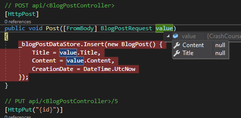
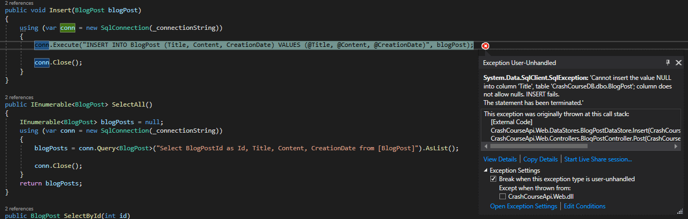
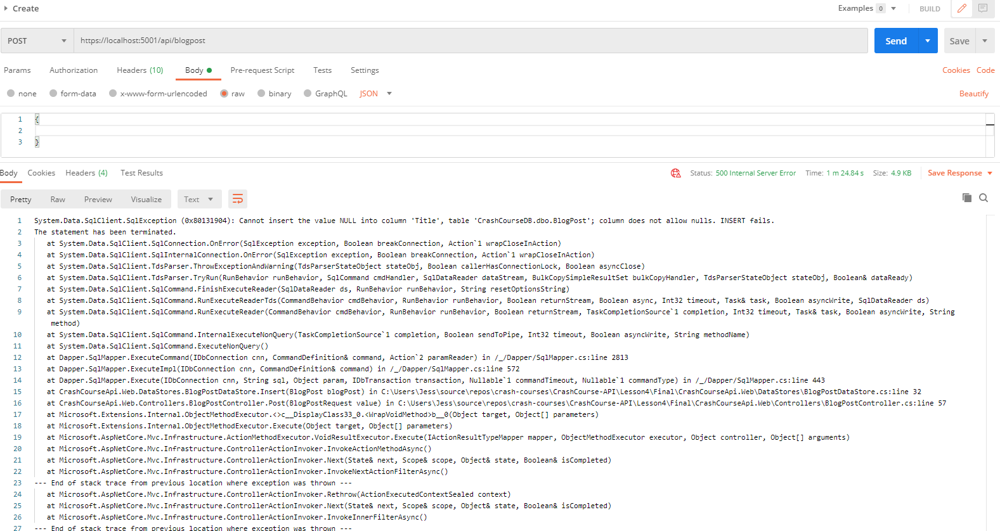
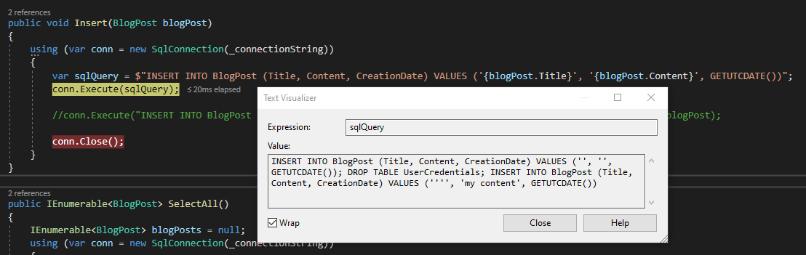
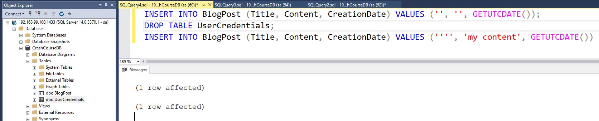
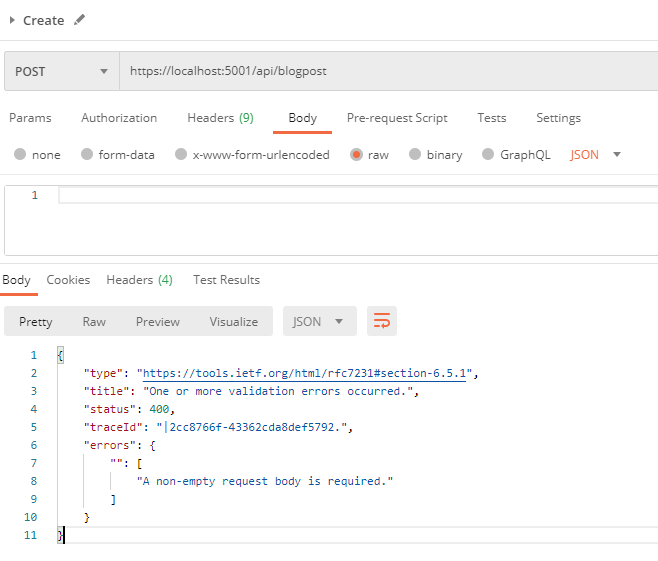
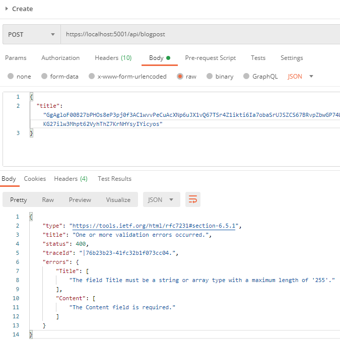
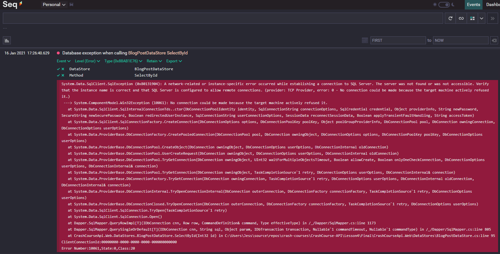
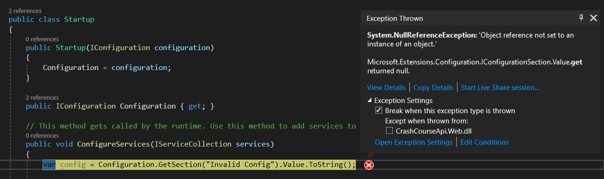
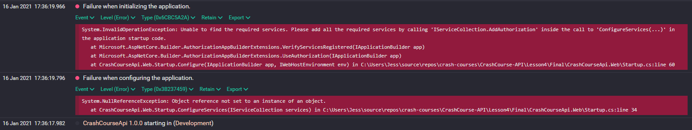

# Lesson 4: Dealing with the unhappy scenarios

So far, we have been nice to our API. We have been posting valid data, the database was available, the settings correct... This is now time to consider when things start to go wrong. Murphy's law states "Anything that can go wrong will go wrong" and this is definitely true for our API. 

We are going to cover a certain number of topics to handle unhappy paths: 
- Model Validation
- Try/Catch Exception & Logging
- Unhandled Exceptions & Crashes

Get started by running the docker-compose available in the ./Prep (seq added).

## A. Model Validation 

Anytime that your application takes input data from a user, such as BlogPostRequest in our POST method, you take a risk of him sending invalid data. 

```csharp
void Post([FromBody] BlogPostRequest value)
```

For instance, it could be an empty JSON object: `{}`



This would fail when inserting the data since the database column have been set to "NOT NULL".



And since it is an unhandled exception, it would show in the HTTP Response with a nice stack trace telling about the error. And also revealing to the user, that I have a table named "BlogPost" with a "Title" column, that the application is developed in .NET, that my CrashCourse project has two "layers": Web Controllers, DataStores, and I am using Dapper ORM...



Giving such information to a user is an obvious vulnerability. Combines with bad code and settings, it could even turn nasty. 

Takes this request body:

```json
{
    "title":"', '', GETUTCDATE()); DROP TABLE UserCredentials; INSERT INTO BlogPost (Title, Content, CreationDate) VALUES ('''",
    "content":"my content"
}
```

The code wrote with Dapper is smart enough to stop at the first ";" but what if it had been coded differently:

```csharp
public void Insert(BlogPost blogPost)
{
    using (var conn = new SqlConnection(_connectionString))
    {
        // Vulnerable code: same library wrong usage.
        var sqlQuery = $"INSERT INTO BlogPost (Title, Content, CreationDate) VALUES ('{blogPost.Title}', '{blogPost.Content}', GETUTCDATE())";
        conn.Execute(sqlQuery);

        // Safer code
        conn.Execute("INSERT INTO BlogPost (Title, Content, CreationDate) VALUES (@Title, @Content, @CreationDate)", blogPost);

        conn.Close();
    }
}
```

If used properly, the "vulnerable code" does the same job as the "safer code". But combined with the previous request, the query generated becomes: 



This is a perfectly valid query:



And since the connection string for your application is using the user "sa", assuming you actually have a table called UserCredentials in your DB, it would just drop it. And the API would return a happy status 200 after a job well done. 

This far-fetched example combines the following vulnerabilities:
- **Accessibility**: your API is accessible by a user with bad intentions. This statement is as arbitrary as it sounds.
- **Information about the application and underlying DB**: we have the source code of the code, we know its vulnerabilities, it is an easy malicious request to build. However, we can't assume that the user will not be able to guess if information about the structure of the system is provided (stack trace is an obvious one, but any output is a potential source of info). It won't be in just one attempt.., silent (we have no logging in place yet), repeated and automated operations could reveal enough about the system. 
- **Vulnerability of the implementation**: used properly, Dapper would deal with my offensive query. Used badly (1 line of code is enough) and the world collapse. However this is not enough, anytime you use an external library (especially an open source one for which the source code and its potential vulnerabilities are available to the world): you have to understand it, test it against known vulnerabilities, keep up-to-date on newly found vulnerabilities... 
- **God-Like permissions**: Having a service SQL account with only the necessary permissions (SELECT, INSERT, UPDATE, DELETE) is a bare minimum. 

This example harms intentionally the system, but most of the time the errors are coming from badly formatted request. Returning a "Title can't be NULL" error might be confusing for a non-tech user and user-friendly errors from input validation can be combined with proper exception handling (Cf. Try/Catch Exception & Logging). Depending on how much code you have before reaching your datastore, the request should fail fast if its doom is sealed already. 

ASP.NET Core has by default a very basic validation. For instance, passing a JSON with '' would send this error. 



This error validation can be extended. 

Let's go to the ./Models/BlogPostRequest object and include the following attributes: 

```csharp
public class BlogPostRequest
{
    [Required]
    [MaxLength(255)]
    public string Title { get; set; }

    [Required]
    [MaxLength(4000)]
    public string Content { get; set; }
}
```

Which will now return more descriptive messages, without waiting for the database response. 



## B. Try/Catch Exception & Logging

For the reasons mentioned above, we want 
- to catch exceptions before they reach the user with plenty of details
- to log the issues so we can investigate them later

If you check the WeatherForecastController controller, you will notice that an instance of type "ILogger<>" can be injected into our own classes. 

Let's update the `BlogPostDataStore` class to include this dependency: 

```csharp
private readonly ILogger<BlogPostDataStore> _logger;

public BlogPostDataStore(IConfiguration configuration, ILogger<BlogPostDataStore> logger)
{
    _connectionString = configuration.GetConnectionString("CrashCourseDb");
    _logger = logger;
} 
```

To catch the exception, use the try/catch block for all your methods:

```csharp
public bool Insert(BlogPost blogPost)
{
    using (var conn = new SqlConnection(_connectionString))
    {
        try
        {
            conn.Execute("INSERT INTO BlogPost (Title, Content, CreationDate) VALUES (@Title, @Content, @CreationDate)", blogPost);
            return true;
        }
        catch (Exception ex)
        {
            _logger.LogError(ex, TemplateException, DataStore, "Insert");
            return false;
        }
        finally
        {
            conn.Close();
        }
    }
}
```

The "finally" block is executed if the try {} block succeeded or not. 

If we catch the exception and just log, the API controller will not know that something bad happens. 
- For the methods that do not return any result, we have to return one. We need to change both the signatures in the class and the interface. 
- For the SelectAll method, if we return null instead of a list, we need to handle the error.
- For the SelectById method, we defined that a null answer meant that the object could not be found. If two types of response can mean two things, this could make the debug more difficult in case of issues. There are multiple ways that we can deal with this, for this course, we will just use a Tuple here.  

```csharp
public Tuple<BlogPost, bool> SelectById(int id)
{
    BlogPost blogPost = null;
    bool result = false;
    using (var conn = new SqlConnection(_connectionString))
    {
        try
        {
            blogPost = conn.QuerySingleOrDefault<BlogPost>("Select BlogPostId as Id, Title, Content, CreationDate from [BlogPost] where BlogPostId = @Id", new { Id = id });
            result = true;
        }
        catch (Exception ex)
        {
            _logger.LogError(ex, TemplateException, DataStore, "SelectById");
            result = false;
        }
        finally
        {
            conn.Close();
        }
    }
    return new Tuple<BlogPost, bool>(blogPost, result);
}
```

Temporarly fix the controller after this last change:

```csharp
[HttpGet("{id}")]
public BlogPostResponse Get(int id)
{
    var blogPostEntity = _blogPostDataStore.SelectById(id);
    if (blogPostEntity.Item1 == null)
    {
        return null;
    }    
    return new BlogPostResponse()
    {
        Id = blogPostEntity.Item1.Id,
        Title = blogPostEntity.Item1.Title,
        Content = blogPostEntity.Item1.Content,
        CreationDate = blogPostEntity.Item1.CreationDate
    };
}
```

Back in the controller, we have to change some of the response object and behaviours. Several implementations possible here as well. When considering implementation, it is important to understand if there are any standards in place already. If the consumer of your API is another application, it might expect a certain format for good and bad responses. 
We will keep simple for now (VS Template is based on the MVC libraries so we will keep this implementation).

- Install `Microsoft.AspNetCore.Mvc.Abstractions` nuget package
- Replace the returned object by `IActionResult` and transform the valid responses with Ok(result)
- Return a StatusCode(503) in case of exception (coming from DB)
- Get All:

```csharp
[HttpGet]
public IActionResult Get()
{
    var blogPostEntities = _blogPostDataStore.SelectAll();

    if (blogPostEntities == null)
        return StatusCode(503);

    return Ok(blogPostEntities.Select(x => new BlogPostResponse()
    {
        Id = x.Id,
        Title = x.Title,
        Content = x.Content,
        CreationDate = x.CreationDate
    }));
}
```

- Update Post, Put, Delete in a similar fashion:

```csharp
[HttpDelete("{id}")]
public IActionResult Delete(int id)
{
    var result = _blogPostDataStore.Delete(id);
    return result ? Ok() : StatusCode(503);
}
```

- Update GetById. Instead of returning null when no BlogPost is found, we return a formatted error.  

```csharp
[HttpGet("{id}")]
public IActionResult Get(int id)
{
    var blogPostEntityResponse = _blogPostDataStore.SelectById(id);

    // If something went wrong:
    if (!blogPostEntityResponse.Item2)
    {
        return StatusCode(503);
    }

    // If the item was not found
    // We now throw an error, but with a more descriptive message
    // Status code is now 404
    if (blogPostEntityResponse.Item1 == null)
    {
        // To keep same format than other errors
        var errors = new Dictionary<string, string[]>
        {
            { "id", new string[] { $"Blog Post for ID '{id}' not found" } }
        };

        return NotFound(new { 
            status = 404, 
            errors = errors
        });
    }

    var blogPostEntity = blogPostEntityResponse.Item1;
    return Ok(new BlogPostResponse()
    {
        Id = blogPostEntity.Id,
        Title = blogPostEntity.Title,
        Content = blogPostEntity.Content,
        CreationDate = blogPostEntity.CreationDate
    });
}
```

As you can see, handling errors make the code more complex. 

## C. Using an external logger

The default logger will log to the Console. If you wish to send your logs into a log server, you will need some extra configuration.

[Serilog](https://github.com/serilog/serilog) is a logging library that supports a large number of logging systems: local text files, SEQ, ES, DataDog, Loggly & more.

We will configure our applications to send logs to local `seq` (started on the docker-compose).

In a browser, go to http://localhost:5341/#/events to check that you can connect to your local seq instance.

In your application, 
- add `Serilog` nuget package
- add `Serilog.Settings.Configuration` nuget package
- add `Serilog.Sinks.Seq` nuget package, for support SEQ logging.
- update the Startup.cs constructor and local variable:
```csharp
private readonly ILogger _logger;
public Startup(IConfiguration configuration)
{
    Configuration = configuration;

    _logger = new LoggerConfiguration()
                    .ReadFrom.Configuration(configuration)
                    .CreateLogger();

    // Add an information log when your application starts
    _logger.Information("{ApplicationName} {Version} starting in ({Environment})", "CrashCourseApi", "1.0.0", Environment.GetEnvironmentVariable("ASPNETCORE_ENVIRONMENT"));
}
```
- Add the dependency: `services.AddSingleton(_logger);` to ConfigureServices()
- In the appSettings.json file, add the following block and remove `Logging` section
```json
"Serilog": {
    "WriteTo": [
       { "Name": "Seq", "Args": { "serverUrl": "http://localhost:5341" } }
    ]
  }
```
- In the BlogPostDataStore, override the ILogger<T> by ILogger. Use namespace `Serilog` in place of `Microsoft.Extensions.Logging`. Fix the syntax issue such as _logger.LogError to _logger.Error.

In order to test your config, update the connection string to point to an invalid server and run your application:



Stop the application, and revert the change on the connection string.

## D. Unhandled Exceptions & Crashes

Inside the controller, the exception is handled by the framework. But you should be aware that the exception can occur somewhere else: it could come from a low-level exception (such as OutOfMemoryException) or someplace not yet protected by some try/catch. 

Exception thrown in Startup.cs does not get caught, so let's simulate an exception there: 



When an application crashes with an unhandled exception, it won't recover by itself. When deployed into an environment, a crash process would require a manual intervention to restart it, unless you have a service manager (eg. Windows Service Manager). You have to consider two scenarios though:
- if the issue happens after running for a long time, a restart of the service could temporarily "fix" it (eg. System Out of Memory). The service can carry to run while a fix is made for the original issue. 
- if the issue happens when the service starts, your service manager/orchestrator could loop infinitely on restarts; since the issue originates from bad code or due to bad config (this is likely to happen after a deployment or when the application starts), it won't recover by itself. To mitigate this, you can catch the exceptions and let the process runs but doing nothing (in our example, it would not start any HTTP listening at all)

In Startup.cs:

```csharp
public void ConfigureServices(IServiceCollection services)
{
    try
    {
        // Simulate an exception when starting
        var config = Configuration.GetSection("Invalid Config").Value.ToString();

        // dependencies
    }
    catch(Exception ex)
    {
        _logger.Error(ex, "Failure when configuring the application.");
    }
}

public void Configure(IApplicationBuilder app, IWebHostEnvironment env)
{
    try
    {
        // app.Use()
    }
    catch(Exception ex)
    {
        _logger.Error(ex, "Failure when initializing the application.");
    }
}
```

If you attempt to run the application now, it will not stop the application anymore and show error messages instead. 



Stop the application, remove the code simulating the exception.

This lesson covered the unhappy path and handled exceptions. The next lesson will help on developing a more reliable application.
