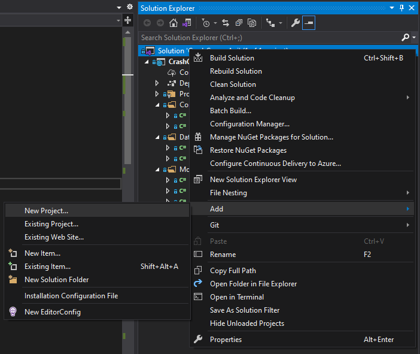
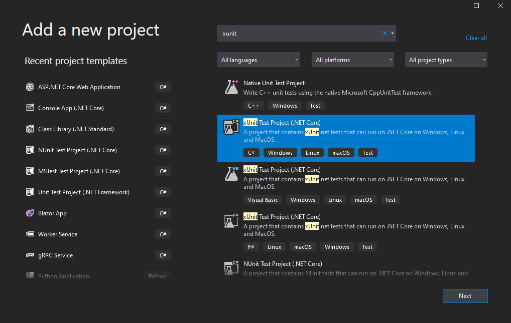
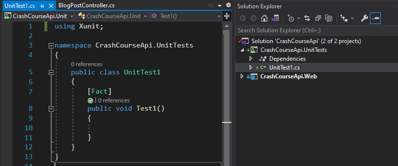
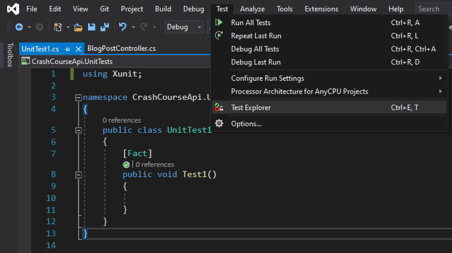
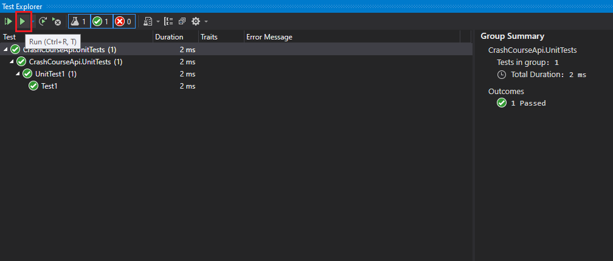
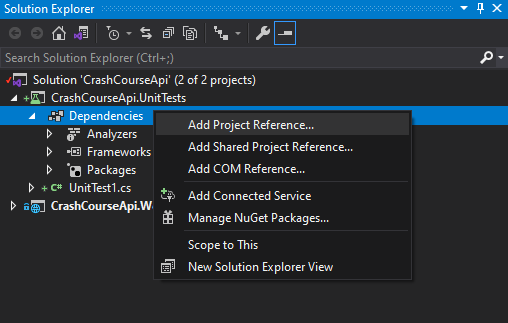
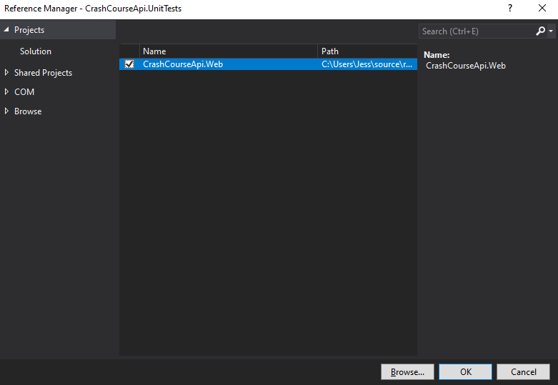
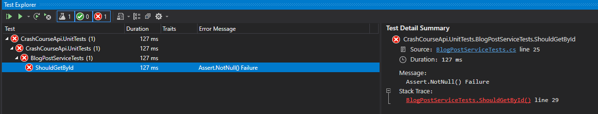
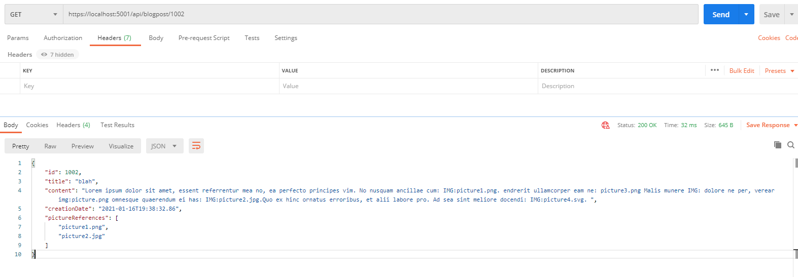

# Lesson 5: Service Layer, Unit Testing & Dependency Injection

Get started by running the docker setup (described in Lesson 3).

In Lesson 4, we tested only the happy scenario. In this lesson, we also have to test the unhappy ones and the number of reasons for failure are many and so is the number of tests to perform. Our API is simple but if you have to modify it, you will want to do regression tests before it reaches production.

So far, all the tests we did were manual, from curl or Postman, when the application is running. Manual testing is not just dull, it is also error-prone... If the code has more complex requirements, with different response to test, then automated testing is an essential tool. In addition, this automated testing will be triggered as part of your Continuous Integration (CI) pipeline to enforce a good quality code. 

To keep it simple, we will discuss only these two:
* **Acceptance Tests**: What we did manually. Calling the API and updating the database. But done by another application. There are some testing framework out to help you out. This implies to an accessible database, and for testing your business logic alone, unit testing is preferred. You also need to consider that the database will keep growing if not cleaned of the test data. 
* **Unit Tests**: Unit Tests test your components / classes as separated unit, by checking inputs and expected/actual outputs of methods. External dependencies (db server) are not going to be tested directly (there will be mocked). These days, unit tests are part of the minimal production application. There are so incorporated in the life of the developer that a development methodology TDD (Test Driven Development) has been built around it, and Code Coverage tools measure code quality based on the number of lines covered by tests. Hence, this has a specific section just for it. 

To fully understand the scope of unit testing, let's implement some business requirements. 

**Step 1**: understand the business requirement and changes involved

Consider the following business requirement: 

```
Given I am writing blog post content with picture references 
When I create a new Blog Post 
   And the content contains png or jpg picture references using the following  "IMG:<picture-name>.<extension>" format
Then I should be able to view the referenced pictures in a separate field
```

I made that one out of thin air, consider it a classic. 

For example, the following Blog Post Content: 
```
Lorem ipsum dolor sit amet, essent referrentur mea no, ea perfecto principes vim. No nusquam ancillae cum: IMG:picture1.png. Hendrerit ullamcorper eam ne: picture3.png Malis munere IMG: dolore ne per, verear img:picture.png omnesque quaerendum ei has: IMG:picture2.jpg. Quo ex hinc ornatus erroribus, et alii labore pro. Ad sea sint meliore docendi: IMG:picture4.svg. 
```
Will return the following references: picture1.png, picture2.jpg. 4 potential sources of error in this sample text: 
- `picture3.png`: no tag IMG:
- `IMG:` no images
- `IMG:picture4.svg`: invalid picture extension
- `img:picture.png`: tag is in lower case

This requirement implies the parsing of the Content text, which could cause a bit of latency in our requests. 

There are several ways of implementing this: for instance, we could
- parse the content when creating and updating the content and store it in DB. Potentially slower writes. 
- parse the content on the fly when retrieving the data. Potentially slower reads. 

For this lesson, we implement the later to avoid changing the DB schema. But in real life, the choice of your implementations will depend of other factors (eg. frequent reads, cached reads, presence of db read replicas,...) and require application metrics for smarter decisions.

**Step 2**: refactoring into service layers

In terms of code location, so far, we had everything in the controller, so the requirements would be place between data retrieval and sending back the response. 

```csharp
// GET api/<BlogPostController>/5
[HttpGet("{id}")]
public BlogPostResponse Get(int id)
{
    var blogPostEntity = _blogPostDataStore.SelectById(id);
    if (blogPostEntity == null)
    {
        return null;
    }

    List<string> referencePictures = null; 
    // Parse blogPostEntity.Content and update Reference Pictures
    
    return new BlogPostResponse()
    {
        Id = blogPostEntity.Id,
        Title = blogPostEntity.Title,
        Content = blogPostEntity.Content,
        CreationDate = blogPostEntity.CreationDate,
        PictureReferences = referencePictures
    };
}
``` 

The GET method is quickly going to become complex and similarly to the datastore, we will create a new class. Right now, in order to test our business requirement, the following code forces us to have an actual web server and database in place. Every single attempt to parse the code would result in having to run the app, call the API and debug. 

Usually, Web service (controllers), service (business logic) and datastore (db access) will be splitted. There are many variances, with additional layers and different projects entirely, but these 3 layers are often a minimal requirement for a project to allow proper unit testings. There are often different classes defined for Request, Response and Domain Object, but depending on the number of layers, this could increase. ONION architecture proposes more for instance.


Another reason for the split is that if we have to change one of the layer (for instance, using NoSql instead of RDBMS), we take the risk of changing something in the web service implementation and do collateral damage. Service layer will be most likely to change because of business requirements. Isolating the service and datastore is needed to be able to replace code without impacting the other layers, as long as the "contract", method signatures, do not change (as a reminder IBlogPostDataStore was our contract for BlogPostDataStore). Another reason for changes, would be to do some refactoring. 

Last but not least, we want each of these "layers" or set of classes (services or datastore) to do a single piece of work (single responsibility principle). The datastore will be in charge of the db connection and handling mapping between class and SQL entities. Service will deal with business logic and dealing with the results provided by the datastore. Controllers will deal with incoming http requests, call the service and outcoming responses. 

Let's get started:
- Create a folder "Services"
- Create an interface called IBlogPostService
- Create a class called BlogPostService and implement the new interface
- Add the following constructor and variable:

```csharp
private readonly IBlogPostDataStore _blogPostDataStore;
private readonly ILogger _logger;

public BlogPostService(IBlogPostDataStore blogPostDataStore, ILogger logger)
{
    _blogPostDataStore = blogPostDataStore;
    _logger = logger;
}
```

- Add the following contract to the `IBlogPostService` interface and implement it in `BlogPostService`. Note that few names have change along the way. 

```csharp
public interface IBlogPostService
{
    IEnumerable<BlogPost> GetAll();
    Tuple<BlogPost, bool> GetById(int id);
    bool Insert(BlogPost blogPost);
    bool Update(BlogPost blogPost);
    bool Delete(int id);
}
```

- Move the datastore from the controller to the service. The parse content requirement have now is place in the service method GetById. 

```csharp
public class BlogPostService: IBlogPostService
{
    private readonly IBlogPostDataStore _blogPostDataStore;
    private readonly ILogger _logger;

    public BlogPostService(IBlogPostDataStore blogPostDataStore, ILogger logger)
    {
        _blogPostDataStore = blogPostDataStore;
        _logger = logger;
    }

    public bool Delete(int id)
    {
        return _blogPostDataStore.Delete(id);
    }

    public IEnumerable<BlogPost> GetAll()
    {
        return _blogPostDataStore.SelectAll();
    }

    public Tuple<BlogPost, bool> GetById(int id)
    {
        // TODO: Parse the content here
        return _blogPostDataStore.SelectById(id);
    }

    public bool Insert(BlogPost blogPost)
    {
        return _blogPostDataStore.Insert(blogPost);
    }

    public bool Update(BlogPost blogPost)
    {
        return _blogPostDataStore.Update(blogPost);
    }
}
```

- Use Service contract instead of DataStore contracts in the controller

```csharp
[Route("api/[controller]")]
[ApiController]
public class BlogPostController : ControllerBase
{
    private readonly IBlogPostService _blogPostService;

    public BlogPostController(IBlogPostService blogPostService)
    {
        _blogPostService = blogPostService;
    }

    // GET: api/<BlogPostController>
    [HttpGet]
    public IActionResult Get()
    {
        var blogPostEntities = _blogPostService.GetAll();

        // handling response
    }

    // GET api/<BlogPostController>/5
    [HttpGet("{id}")]
    public IActionResult Get(int id)
    {
        var blogPostEntityResponse = _blogPostService.GetById(id);

         // handling response
    }

    // POST api/<BlogPostController>
    [HttpPost]
    public IActionResult Post([FromBody] BlogPostRequest value)
    {
        var result = _blogPostService.Insert(new BlogPost()
        {
            Title = value.Title,
            Content = value.Content,
            CreationDate = DateTime.UtcNow
        });
        return result ? Ok() : StatusCode(503);
    }

    // PUT api/<BlogPostController>/5
    [HttpPut("{id}")]
    public IActionResult Put(int id, [FromBody] BlogPostRequest value)
    {
        var result = _blogPostService.Update(new BlogPost()
        {
            Id = id,
            Title = value.Title,
            Content = value.Content
        });
        return result ? Ok() : StatusCode(503);
    }

    // DELETE api/<BlogPostController>/5
    [HttpDelete("{id}")]
    public IActionResult Delete(int id)
    {
        var result = _blogPostService.Delete(id);
        return result ? Ok() : StatusCode(503);
    }
}
```

So far, we created an intermediate layer between controllers and datastore layer and made no other changes. 

Last changes to make it all work. Go to `Startup.cs`, and add the following code near the other configured service.

```csharp
public void ConfigureServices(IServiceCollection services)
{
    services.AddControllers();
    services.AddTransient<IBlogPostService, BlogPostService>();
    services.AddSingleton<IBlogPostDataStore, BlogPostDataStore>();
}
```

These three instructions "injects" implementations whenever a contract is met.
- Controllers dependencies are injected by the ASP.NET Core framework. 
- AddSingleton: will create a single instance and inject the same one everytime the contract `IBlogPostDataStore` is met. 
- AddTransient: will create a new instance every time that the contract `IBlogPostService` is met. 

For eg., BlogPostController has a dependency to BlogPostService and an instance of the dependency is injected everytime the constructor is called. For every service instance, the same instance of datastore is being injected.  

When it comes to test your controller, you can use the contract to mock your dependencies, allowing you to test your unit in isolation.

Run the application to check that the refactoring was successful.

**Step 3**: Add unit test project

Since it is a rather complex requirement, we are going to proceed by steps and tests our implementation. 

Unit tests will come handy very quickly, but first, we need to create a new project. There are several test frameworks that can be used, we will use XUnit. 

Create a new project:



Search for the XUnit Project:



Name the project `CrashCourseApi.UnitTests` and Create.



Go to Test Explorer: 



And run the empty test:



Add a Project Reference:



And include your project: 



Add `Moq` nuget package

Rename UnitTest1.cs to BlogPostServiceTests.cs and copy the following base code:

```csharp
public class BlogPostServiceTests
{
    private readonly Mock<IBlogPostDataStore> _mockBlogPostDataStore;
    private readonly Mock<ILogger> _mockLogger;

    private IBlogPostService _service;

    public BlogPostServiceTests()
    {
        // Constructor is mocking the dependencies
        _mockBlogPostDataStore = new Mock<IBlogPostDataStore>();
        _mockLogger = new Mock<ILogger>();

        _service = new BlogPostService(_mockBlogPostDataStore.Object, _mockLogger.Object);
    }

    [Fact]
    public void ShouldGetById()
    {
        // When the service is called, the database was not called
        var result = _service.GetById(1);

        Assert.NotNull(result);
    }
}
```

When running the tests, this should fail: 



You can debug your test by right clicking on the test: 


The test fails because we haven't yet configured the mock so it does not return any object. Replace the test by this one:

```csharp
[Fact]
public void GivenExistingPostBlog_WhenGetByIdCalled_ThenBlogPostReturned()
{
    // arrange
    var mockResult = new BlogPost() { 
        Title = "Title", 
        Content = "Lorem ipsum dolor sit amet, essent referrentur mea no, ea perfecto principes vim. No nusquam ancillae cum: IMG:picture1.png. " +
        "Hendrerit ullamcorper eam ne: picture3.png Malis munere IMG: dolore ne per, verear img:picture.png omnesque quaerendum ei has: IMG:picture2.jpg." +
        "Quo ex hinc ornatus erroribus, et alii labore pro. Ad sea sint meliore docendi: IMG:picture4.svg. "
    };
    _mockBlogPostDataStore
        .Setup(x => x.SelectById(1)) // Setup the mock's method
        .Returns(new Tuple<BlogPost, bool>(mockResult, true)); // return the mock result

    // act
    var result = _service.GetById(1);

    // assert
    Assert.NotNull(result);
    Assert.True(result.Item2);
    Assert.Equal("Title", result.Item1.Title);
}
```

* arrange: setup of your test mocks. In my test, we won't access the DB to fetch the item. We have to mock it, then set up the method that will be called to return this mock object. 
* act: call the service
* assert: validate the result

As we change our code to implement the requirements, this test should stay green! This will be our reference regression test. 

We can add some more tests to test intermediate steps: this is not truly TDD, but will certainly help to develop the requirements. 

**Step 4**: Implement the requirements

First, we need to add a property `public IEnumerable<string> PictureReferences { get; set; }` to our BlogPost class. 

Second, update the `GetById` in `BlogPostService`:

```csharp
public Tuple<BlogPost, bool> GetById(int id)
{
    // Call datastore 
    var blogPost = _blogPostDataStore.SelectById(id);

    // If not found, return the object. Controller will return a NotFound response
    if (blogPost == null)
        return blogPost;

    // Parse the content to find string
    var content = blogPost.Item1.Content;

    // Result will be stored here:
    blogPost.Item1.PictureReferences = new List<string>();

    return blogPost;
}
```

Run your test project to check for any regressions. You split your test case:

```csharp
[Fact]
public void GivenExistingPostBlog_WhenGetByIdCalled_ThenBlogPostReturned_AndContentContainsPngPicture()
{
    // arrange
    BuildMockBlogPost("IMG:picture1.png");

    // act
    var result = _service.GetById(1);

    // assert
    var picture = result.Item1.PictureReferences.ToList();
    Assert.Single(picture);                   // test if there is 1 item in the list
    Assert.Equal("picture1.png", picture[0]); // test if the value is correct
}

[Fact]
public void GivenExistingPostBlog_WhenGetByIdCalled_ThenBlogPostReturned_AndContentContainsJpgPicture()
{
    // arrange
    BuildMockBlogPost("IMG:picture2.jpg");

    // act
    var result = _service.GetById(1);

    // assert
    var picture = result.Item1.PictureReferences.ToList();
    Assert.Single(picture);                   // test if there is 1 item in the list
    Assert.Equal("picture2.jpg", picture[0]); // test if the value is correct
}

[Fact]
public void GivenExistingPostBlog_WhenGetByIdCalled_ThenBlogPostReturned_AndContentContainsSvgPicture()
{
    // arrange
    BuildMockBlogPost("IMG:picture4.svg");

    // act
    var result = _service.GetById(1);

    // assert
    var picture = result.Item1.PictureReferences.ToList();
    Assert.Empty(picture); 
}

[Fact]
public void GivenExistingPostBlog_WhenGetByIdCalled_ThenBlogPostReturned_AndContentContainsPngPictureButNoTag()
{
    // arrange
    BuildMockBlogPost("picture3.png");

    // act
    var result = _service.GetById(1);

    // assert
    var picture = result.Item1.PictureReferences.ToList();
    Assert.Empty(picture);
}

[Fact]
public void GivenExistingPostBlog_WhenGetByIdCalled_ThenBlogPostReturned_AndContentContainsPngPictureButTagInLowercase()
{
    // arrange
    BuildMockBlogPost("img:picture3.png");

    // act
    var result = _service.GetById(1);

    // assert
    var picture = result.Item1.PictureReferences.ToList();
    Assert.Empty(picture);
}

private void BuildMockBlogPost(string content)
{
    var mockResult = new BlogPost()
    {
        Title = "Title",
        Content = content
    };
    _mockBlogPostDataStore
        .Setup(x => x.SelectById(1)) // Setup the mock's method
        .Returns(new Tuple<BlogPost, bool>(mockResult, true)); // return the mock result
}
```

In the BlogStoreService, one of the solution can be this implementation:

```csharp
var content = blogPost.Item1.Content;

// Regex is a library to find patterns in strings
// This is also the most cryptic library ever. 
// Use online tool like this one: https://regexr.com/
var regex = new Regex(@"(IMG:)\w+.png|(IMG:)\w+.jpg");
var matches = regex.Matches(content);

// foreach matches found in the string
// replace the IMG: tag by empty string
// and return it as the list of picture references
blogPost.Item1.PictureReferences = matches.Select(x => x.Value.Replace("IMG:", ""));
```

The point of this exercice was to show how a simple requirement could involve many scenarios,  how unit tests could help develop and test for regression. Imagine having to change the requirement now (eg. add jpeg as well) or refactor the regexp pattern, then, you will be glad to have a safeguard! Feel free to challenge yourself finding a better Regexp for our requirement, or choose a different approach entirely!

Final piece of the puzzle, we still need to return this list to the browser:
- add a `public IEnumerable<string> PictureReferences { get; set; }` into the BlogPostResponse
- map the PictureReferences property between BlogPost and BlogPostResponse. 

Run your application, create a new BlogPost with the complex content then get it by ID:



