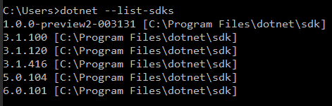
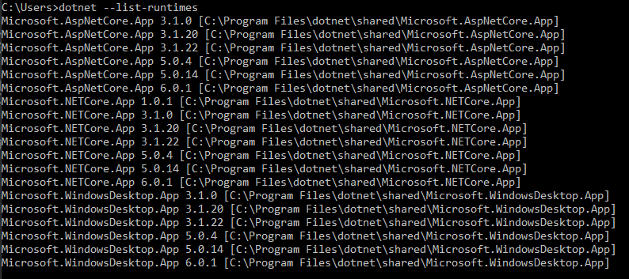

# Lesson 1: Local Development

## Introduction

If you went through the previous crash courses, you followed a step to install Visual Studio. While developing, Visual Studio was doing for you some commands behind the scene to execute your code and run your tests. 

As soon as we want the code to execute from a different machine, on a test or production environment, we will stick to the minimal dependencies for our code to execute and not require unnecessary development tools (SDK). These dependencies are called the runtime (dotnet runtime in our case). 

In addition of your development machines for each of your developers, imagine that you have 4 servers to install your application, then you will have to install the runtime on each. If you have a continuous integration environment to build your dependencies (See Lesson 2), it may also require the dependencies. 

For a long time, .NET used to be a technology forcing the development and execution on Windows machines and surrounded by Microsoft technologies. IIS to host ASP.NET web applications are a common example. The trend of .NET developers to use Windows and VS for development even now that it's not a requirement anymore is probably another! This used to cause some problems around licensing cost and compatibility amongst other lengthy arguments. That's one of the reasons that motivated the creation of .NET Core, and explains the technological gap (and in "mindset") between .NET Core and .NET Framework. In Lesson 4, we will explore how containers helped this effort, simplifying and standardising the way we host services independently of programming language constraints. 

But in Lesson 1, we will try to understand how we got there in the first place, and get back to the basics. By the end of it, we will have created a makefile to organize our commands that we can reuse in the next lesson. 

## Basic commands

If you follow this crash-course, chances are that you have only NET SDK 3.1 installed on your machine and you do not require anything else for this exercise. If you are a regular .NET coder, your setup is likely to look like mine:



`dotnet --list-sdks` shows you the list of installed versions. 

When running the commands described in this section, by default the latest version is used. If you have an higher version of dotnet installed, please run the extra steps. 

Create a folder `my-app`.

<details>
    <summary>Extra steps when multiple SDKs are installed</summary>
    <p>
Inside `my-app` folder:<br/> 
Run `dotnet new globaljson`.<br/> 
Edit global.json to match the latest minor version of 3.1 installed on your machine:<br/> 

```json
{
    "sdk": {
        "version": "3.1.416"
    }
}
```

The command runs in this folder will now target 3.1 when using dotnet templates.
</p>
</details>


Create two folders `src` and `test` under `my-app`.

Create a `my-project` folder under `src`.

Create a `my-project-tests` folder under `test`.

<details>
    <summary>Commands</summary>
mkdir my-app<br/>
mkdir my-app\src<br/>
mkdir my-app\test<br/>
mkdir my-app\src\my-project<br/>
mkdir my-app\src\my-project-tests<br/>
cd my-app\src\my-project<br/>
<br/>
</details>

This structure of folders tends to be a convention in the .NET world.

In the `my-project` folder, create a new project by running:

`dotnet new console`

`console` is a dotnet template, we could have chosen an API here but there would have been more files. You can run `dotnet new --list` to list the template install on your development machine.

This command created two files that you should be familiar with:
- `my-project.csproj`: contains basic properties described using XML to define how to build and execute your project. 
- `Program.cs`: contains the classic "hello world" sample code

Now run the following command to compile your code and create binaries (e.g. C# classes to DLLs):

`dotnet build`

Then, run your application:

`dotnet run`

"Hello world" should have ran smoothly.

These are extremely simple commands, to which we will add  arguments.

In a test or production environment, the last command is the only your really require. This assumes that the project is already built (by a "build" server) and DLLs copied there to be executed (by a "deploy" service). As you will see in Lesson 2, the build part falls into the CI reponsibilities (but not only). As you will see in Lesson 3, the deployment part falls into the CD reponsibilities (but not only). 

Now let's create a test project. In the `my-project-tests` folder, create a new project by running:

`dotnet new mstest`

Run `dotnet build` then `dotnet test`. This should run your test (and pass).

In Lesson 2, we will setup CI to run the test automatically.

And with this, we should have the following structure:
```
my-app/
    src/
        my-project/
            Program.cs
            my-project.csproj
    test/
        my-project-tests/
            my-project-tests.csproj
            UnitTest1.cs
```

At this point, you could modify Program.cs and/or UnitTest1.cs files, by editing using any file editor, then Rebuild & Run. If your editor do not help you with Intellisense, this might rapidely become cumbersome. 

We need a few more commands to allow opening your project from Visual Studio.

Go back to the root folder `/my-app`, and run:

`dotnet new sln`

This creates a solution file `my-app.sln`.

To add projects we created above, in same location of your SLN file, run:
- `dotnet sln add src/my-project`
- `dotnet sln add test/my-project-tests`

You can then open `my-app.sln` with Visual Studio and be on familiar ground again. 

<details>
    <summary>Bonus example: Adding a class library `my-lib` and including reference to my-project</summary>
From my-app folder:
<ul>
<li>mkdir src\my-lib</li>
<li>dotnet new classlib --output src\my-lib</li>
<li>dotnet sln add src/my-lib</li>
<li>dotnet add src/my-project reference src/my-lib</li>
</ul>
Now my-project can use classes of my-lib.
</details>

## Prepare your build process

Now that we covered the basic commands, we can prepare a script that can be reused to build resources everytime you make a change. This adds a few more arguments and commands but there will be explained.

First, we are going to install make and create a makefile. Note that you can chose to keep a shell script here, but `make` allows to structure the commands in a more flexible way.

If you are on windows, you can install make using the command: 

`winget install GnuWin32.Make`

You can check the version installed:

`make --version`

In `my-app` folder, create a file called Makefile (without extension) and copy:

```
build-app:
	echo "Building my app"
	dotnet build
```

Then run `make build-app` in the same folder.

Let's make this a little bit more complicated. First, before we build the project, let's clean and restore. The `clean` command will make sure there is no DLLs left from a previous build in your project. The `restore` command is used to restore nuget packages if any is attached to your project. 

```
build-app:
	@echo "Building my app"
	dotnet clean
	dotnet restore
	dotnet build
```

Then, let's add a new target:

```
build-app:
	@echo "Building my app"
	dotnet clean
	dotnet restore
	dotnet build

test-app: build-app
	@echo "Running tests"
	dotnet test
```

If you run `make test-app` now, it triggers all commands of the first target `build-app` then trigger the tests. 

Finally, add this `publish-app` target and we have everything we need for the next lesson.

```
PROJECT=

build-app:
	@echo "Building my app"
	dotnet clean
	dotnet restore
	dotnet build

test-app: build-app
	@echo "Running tests"
	dotnet test

publish-app:
	@echo "Publishing application $(PROJECT)"
	dotnet publish $(PROJECT) --configuration Release --self-contained true --runtime win10-x64 --output artefact
```

To run the publish-app target:
```
make publish-app PROJECT=src/my-project/my-project.csproj
```

`dotnet build` and `dotnet publish` both produces DLLs and have similar options available, but they aren't used with the same intentions.

The `build` command compiles your C# classes into binary files (DLLs) and include dependencies (e.g. other project reference or nuget packages) so you can execute your application. The `publish` command aims at preparing for deployment into another machine, gathering all the files into a single `publish` folder. It targets the project you want to "deliver". The command implicitly runs all the other dotnet commands seen above and a few more.  
 
With the option specified in our example `--self-contained true --runtime win10-x64`, in addition of our application and direct dependencies, the output folder will contains the necessary runtime DLLs for this specific target OS and architecture: Windows 10 x64. 

You can find the generated content in the folder `\artefact` and notice how many DLLs we have for such a simple application! If you run again the command with a different platform, you will get another folder with possibly difference DLLs (compatible with the right OS/architecture). 

We could obviously specify a different target system or assume the host have already the runtime installed. This last scenario could happen if you are hosting multiple applications into the same server for maintenance and cost reasons. The implications of this type of setup are explored in the next section.

## "It works on my machine"

We haven't even written a single line of C# code ourselves in this lesson that we surface an essential aspect of development. The code won't live on our machine. Beyond writing a script to automate manual (dull) operations on your computer, your application most likely will need and serve users. 

So you will ship your code to a different remote server. But both server and app must guarantee secured access and adapted to your traffic. Both must be adapted to each other to make a product available to end-users. Depending on cost and operational constraints, this server will be more or less dedicated to your application and impact design decisions. Responsibility and ownership tend to "float" a lot more as we reach the gap between different skills and expertise (and job functions).

We also have to consider anything else installed on the machine that could affect the system or software updates (including OS patches..). We also mentioned the framework-specific runtime, with its various versions and compatibility problems. Back in the day, if you maintained a legacy application developed with ASP.NET Framework, it was required to run on a specific Windows Server version with the IIS feature enabled. Consider that you need to deploy another service with a more recent runtime version on this existing server. The newest runtime installation could create unexpected compatibility runtime issues with the old application. 



These obstacles are partially solved by containerization these days (Lesson 4).

While talking about the "publish" command, we alluded to the choice of OS and the architecture family. Both the application code and the framework used could have different lower-level instructions. Client desktop applications require to handle multiple targets. 

In the case of client-facing applications, your users could also be using an unsupported browser (e.g. Internet Explorer 6) or device (e.g. old smartphone) that aren't compatible with some of the features of your application. A solid, automated integration testing solution would be an efficient option but could be hard to maintain. 

But there is more. The hardware, CPU and memory allocated for your application are different. These make some misbehaviour more disastrous (e.g. memory leaks, slower applications). You could also be accessing external resources, on the same or a different network to which you need to establish connectivity, perhaps with other security requirements. These issues could start degrading your service progressively or failing when your application loads environment variables. Strong observability (logs, metrics, etc.) is a must to understanding the system behaviours when it's out of reach of the debug mode! 

And just like that, a bugless application could misbehave as soon as released out on the wild!


[Source](https://donthitsave.com/comic/2016/07/15/it-works-on-my-computer)

As a coder, we should understand how and where our code runs. That is a requirement for building software that can truly thrive and make better technical decisions. The rise of microservice architectures and distributed systems, which increased the likeliness for things to go wrong, have just made it clear that the gap between dev and ops skillset must be filled.