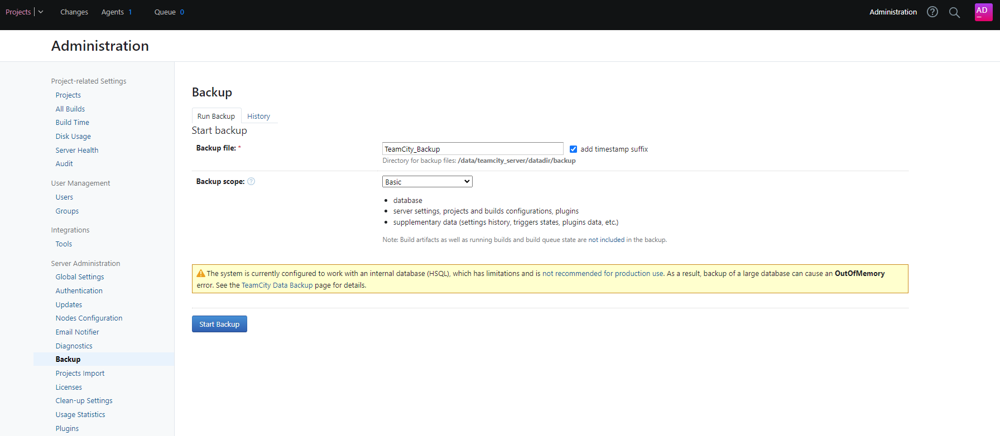

# Lesson 2: Continuous Integration

TODO: Introduction
Bonus: myget local? 

Build/Test + Publish/Pack + Deploy (Copy + Configure)

Copy to a remote location: zip file to either copy 0 or 1 file.

While adding new features or changes, the code increase in size and complexity. More developers get involved in the project, not just the original author(s). Refactoring is a very important step to keep a code readable and maintainable. Code analysis tools & peer reviews will act as safeguards. Unit Testing, Acceptance Testing, Integration Testing will help to spot regressions before reaching release. 

## Step 1: Setting up a TeamCity 

We will set up TeamCity in this lesson but many continuous integration tools are available. The terminology between these tools might differ, but they essentially work similarly. We will need to configure how to "build" our application. I will use the term "build", to describe the steps between fetching the source code to building an artefact (e.g. Zip file) that contains your binaries (e.g. DLLs). 

To simulate a TeamCity server, we will use once again docker. In the docker setup proposed, the following containers are being defined:
- **TeamCity server**: the website, used to configure your projects and visualize your builds
- **TeamCity agent**: a worker service that will run the builds. If you are building .NET Core projects, your agent should have the .NET Core SDK installed to run the `dotnet` commands. By default, TC agent has the dotnet runtime installed. I extended this image so Make is pre-installed.

Once started, the TeamCity server will be available on the following URL: 
http://localhost:8112/.

Proceed with the setup of the server. Select the internal storage as the other external databases requires additional plugins to install.

You will be given the option of creating an admin account. 

After this, you should have the following screen:

Before we create a project, let's have a look at the "Agents" tab: 

Click on "Unauthorized" tab, and click the button "Authorize":

Now your agent should appear "Connected". 

## Step 2: Build the Blog Post API

Now if you go to "Projects", and start creating a project: 
 

The first thing to set up is a Source Control repository (VCS Root) to indicate where TeamCity should fetch the source code. There are many version control platform supported. If your GitHub repository is a public one like the CrashCourse repo, you can directly connect to it using HTTPS without credentials:

Rename the project name to "Blog Post API": 

Once created, the "Build steps" can be configured. 

By default, the agent supports a few very well know frameworks and tools. However, it does not necessarily support all the versions. 

In my example, I will need to specify the relative path to my solution file: 

After saving, click the "Run" button at the top:

Go to Projects. Your agent should have picked up the project and built it successfully:

To check the logs:

You should be able to extend step 1 for more details:

If we click on "Edit Configuration Settings", and check the "Triggers" item on the left menu:

Then, we click on the trigger defined:

TeamCity informs us that "VCS Trigger will add a build to the queue when a VCS check-in is detected". Every time we push code to the repository, a new build will be triggered automatically. This ensures that you can't add new code to the repository, without a successful compilation of the project. When unsuccessful, we can send notifications, but from a Continuous Integration point of view, we will want something more blocking than simple notifications. 

A typical scenario will be to block a " GIT Pull Request" by enforcing CI checks before merging into a branch. This requires a bit more setup around TeamCity and GitHub, out of the scope for this lesson, so I will just show the results: 

When looking at the details:

When the issue is fixed, you will be able to merge:

## Step 3: Test & Publish the application (reusing makefile)

We have just created a new project in TeamCity, that fetches the code of the Blog Post API available in the CrashCourse repository and run the `dotnet build` command to check that my code still compiles. When configured appropriately, this will prevent me from merging breaking code into the main GIT branch. Ideally, we want to be able to run some tests alongside the compilation. For instance, we could run the makefile script that we created in Lesson 1. 

One of the benefit of using a script like the makefile, a  shell script or any other configuration file (e.g. NAnt or Kotlin) is to keep your setup vendor-agnostic and not tie yourself to a CI tool.

> I copied a similar [Makefile](https://github.com/JM89/crash-courses/blob/main/CrashCourse-InterProcessCommunication/Lesson4/Final/BlogPost/Makefile) in the BlogPost API project and installed `make` as a pre-requisite in the agent container prior to this exercise. 

Let's edit the project to reuse the commands. 
Replace the Dotnet Build step by we create a command line and populate the entries:

Then, I create a second step, which will only run when we merge our code into the default branch: 

As you may remember, the `make publish-app` command takes one argument (the location of the csproj relative to the working folder) and publish the outputs in an "artefact" folder. 

From TeamCity, we can specify a location to look for artefact. In general settings, "artifact paths", we will map this location to the "output" folder. We will reuse this location in Lesson 3. 

Then "Run" your project again: 

And check the "Artifacts" tab:

## Next steps

We will extend this setup in Lesson 3 after setting up Octopus server. 

Since we need to have TeamCity in the same docker network context, I created a backup. This is part of the Prep/teamcity-bkp folder.

