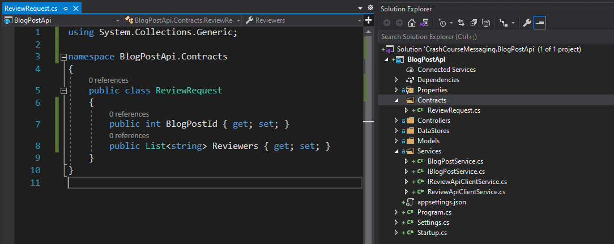
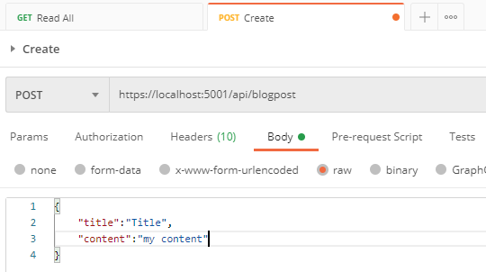
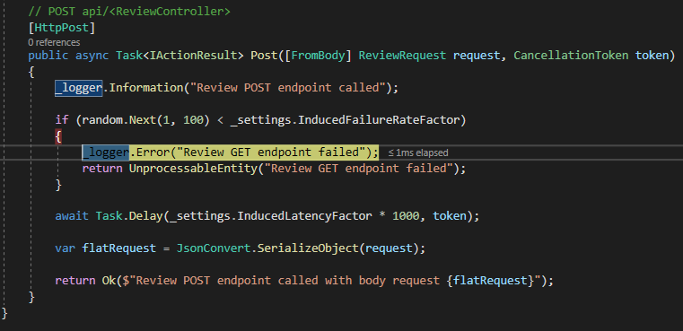
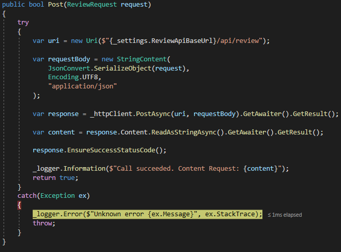
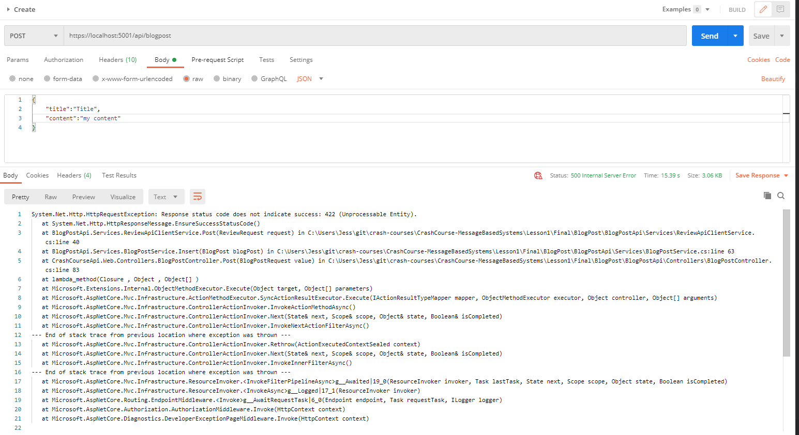
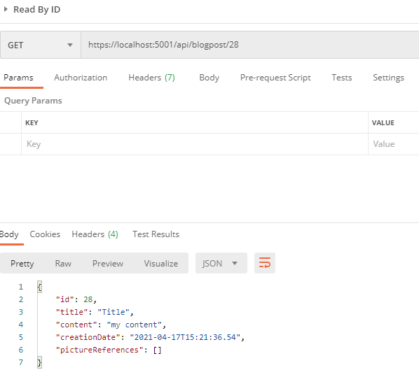
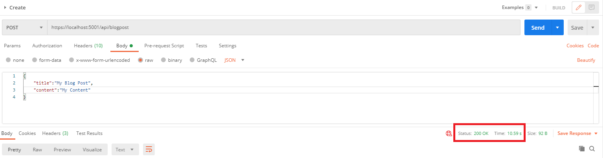
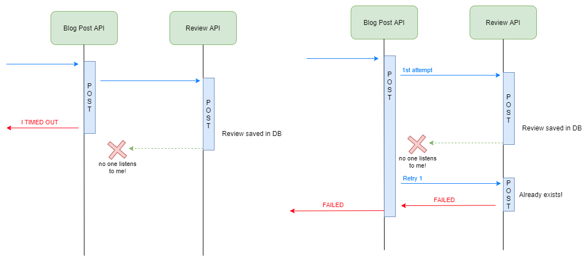

# Lesson 1: Introduction to services (de)coupling

*Note: If you haven't done yet, get started with the "Getting Started" section in [CrashCourse Message-based system](./CrashCourse-MessageBasedSystems/README.md)*

Consider the following business requirement: 

```
Given I am writing blog post content 
When I create a new Blog Post 
Then a Review Request should be submitted
```

To give a bit more business context, when a review is submitted, a list of reviewers can comment and approve the blog post content, but this is not part of the scope of the requirement. From the Blog Post API perspective, we only have to create the Review Request. In this Lesson 1, we will call directly the Review API POST endpoint.

## Side note: monolithic/microservices & atomic transactions

In a monolithic architecture design, you would probably have a table `Review` defined in the same database that we have already created. When creating a blog post, you would ensure that the `Review` table is also updated as part of the same SQL transactions. This would bring atomicity: if one of the insert in any of the table fails (specially the second one), the whole transaction will be rollbacked and your data kept consistent. 

In a microservice architecture design, different business domain are splitted into different services/APIs, potentially coded by a different development team. The downstream services could be reliable, available, scalable, or maybe not. In case of error, rolling back a request is not as easy than in the context of atomic SQL transaction. With distributed systems, there are plenty of inventive ways for things to go wrong in addition of the application bugs and bad resource management (network latency/congestion, infrastructure), so handling failures should be treated as first class citizen. 

Both approaches have pros and cons. There are plenty of articles on the Internet that compares Monolithic and Microservices architectures, and detailed their characteristics. Often, the microservice approach is favored for large system as the benefits outweight the drawbacks, availability is chosen over consistency. But the adoption requires a shift in the coding experience and beyond, and this should be taken in consideration when choosing an architecture style.

But enough for this side note, I'm taking a microservice approach here for this message-based system crash course, and chose that BlogPost and Review belongs to different domains. The split between BlogPost/Review is rather arbitrary here, in a real project, this would obviously require more thinking. 

## Calling the Review API directly

First, let's check that the Review API has been configured to be nice to us. We don't force any failure rate nor latency to our calls while we change the Blog Post API.

Review API `appSettings.json` should look like:
```json
  "Settings": {
    "ServiceName": "Review.Api",
    "InducedFailureRateFactor": 0,
    "InducedLatencyFactor": 0
  },
```

The next steps will be done on the BlogPost API only:

Currently, the code of the `Insert` method in `Services/BlogPostService.cs` class looks pretty simple:

```csharp
public bool Insert(BlogPost blogPost)
{
    return _blogPostDataStore.Insert(blogPost);
}
```

So far, we only call the Data Store layer to insert the item in database. We are going to add the call to our API in this location.

### Step 1: Create a Review Api Client Service

In the Services folder, create a class `ReviewApiClientService.cs` and an interface `IReviewApiClientService.cs` with the following code:

IReviewApiClientService:
```csharp
namespace BlogPostApi.Services
{
    public interface IReviewApiClientService
    {
        bool Post(object o);
    }
}
```

ReviewApiClientService:
```csharp
using Serilog;

namespace BlogPostApi.Services
{
    public class ReviewApiClientService : IReviewApiClientService
    {
        private readonly ILogger _logger;

        public ReviewApiClientService(ILogger logger)
        {
            _logger = logger;
        }

        public bool Post(object o)
        {
            throw new System.NotImplementedException();
        }
    }
}
```

### Step 2: Configure HttpClient Dependency Injection

The base class for HTTP communication between services is the `HttpClient`. Many library have abstracted it away but in our example, we will use a plain one. 

First, let's add it to the readonly variable and constructor, like we have done for every dependencies. Since we are at it, lets also include ILogger and Settings. Let's not forget the namespace `System.Net.Http` (using) as well.

```csharp
using Serilog;
using System.Net.Http;

namespace BlogPostApi.Services
{
    public class ReviewApiClientService : IReviewApiClientService
    {
        private readonly ILogger _logger;
        private readonly HttpClient _httpClient;
        private readonly Settings _settings;

        public ReviewApiClientService(ILogger logger, HttpClient httpClient, Settings settings)
        {
            _logger = logger;
            _httpClient = httpClient;
            _settings = settings;
        }
    }
}
```

In the `Startup.cs`, ConfigureServices method, add the following call:

```csharp
services.AddHttpClient<IReviewApiClientService, ReviewApiClientService>(client =>
{
    client.BaseAddress = new Uri("");
});
```

Make sure that you placed the code, after the Settings initialization:

```csharp
var settings = Configuration.GetSection("Settings").Get<Settings>();
services.AddSingleton(settings);
```

### Step 3: Update the settings to specify a Base Address 

In the `appSettings.json`, add the following settings:

```json
"Settings": {
    "ServiceName": "BlogPost.Api",
    "ReviewApiBaseUrl": "http://localhost:5002/" // We won't cover the extra steps to allow HTTPS in this lesson
},  
```

You want to define your base URL here, not a specific endpoint since each of the calls could be made to different endpoints. 

In the `Settings.cs`, add the new configuration:

```csharp
public class Settings
{
    public string ServiceName { get; set; }

    public string ReviewApiBaseUrl { get; set; }
}
```

Back to the `Startup.cs` file, update the BaseAddress property to use your Settings Property:

```csharp
services.AddHttpClient<IReviewApiClientService, ReviewApiClientService>(client =>
{
    client.BaseAddress = new Uri(settings.ReviewApiBaseUrl);
});
```

### Step 4: Configure HttpClient Dependency Injection

In the `BlogPostService.cs`, configure the ReviewApiClient service in readonly variable and constructor:

```csharp
private readonly IBlogPostDataStore _blogPostDataStore;
private readonly ILogger _logger;
private readonly IReviewApiClientService _reviewApiClientService;

public BlogPostService(IBlogPostDataStore blogPostDataStore, ILogger logger, IReviewApiClientService reviewApiClientService)
{
    _blogPostDataStore = blogPostDataStore;
    _logger = logger;
    _reviewApiClientService = reviewApiClientService;
}
```

### Step 5: Call the ReviewApiClient if BlogPost successfully inserted in DB

Let's transform the method a little bit.

First, split into two lines the call to `Insert` method with returned result `inserted`.

```csharp
public bool Insert(BlogPost blogPost)
{
    var inserted = _blogPostDataStore.Insert(blogPost);
    return inserted;
}
```

Then if the result has been inserted successfully in DB, 
* Call the ReviewApiClient service. For now, let's put "null" in the parameters.
* Log the results

```csharp
public bool Insert(BlogPost blogPost)
{
    var inserted = _blogPostDataStore.Insert(blogPost);

    if (inserted)
    {
        var result = _reviewApiClientService.Post(null);
        _logger.Information($"Result: {result}");
    }

    return inserted;
}
```

### Step 6: Create Contract ReviewRequest

The Review API use an object of type `ReviewRequest` when calling the POST endpoint. The class consists of two properties:

```csharp
public class ReviewRequest
{
    public int BlogPostId { get; set; }
    public List<string> Reviewers { get; set; }
}
```

When calling the API, you will need to send a JSON string (--data) that can be transformed into this class:

```sh
curl -k -X POST https://localhost:5003/api/review -H "Content-Type: application/json" --data "{\"blogpostid\": 1, \"reviewers\":[\"jack\", \"matt\", \"steven\"]}"
```

When calling the Review API from Blog Post API, we need the same structure: we commonly call these classes "Contracts" as they define an "agreement" between two parties. 

*Note that contracts aren't just for direct API calls, message contracts/formats work in a similar fashion.*

If we add another property in the ReviewRequest in Review API, we would need to update it manually in the other Blog Post API. If you have more than one consumer, sharing the changes in contracts can become tedious. For this reason, usually, contracts are shared using Nuget C# Libraries. 

We will keep it simple here by just copy-pasting it.

From the project root, create a folder `Contracts` and a class `ReviewRequest`. Next, copy-paste the content from the Review API. 



### Step 7: Reuse the specific type in the ReviewApiClient interface and class

After this change, your ReviewApiClientService Post method should look like this:

```csharp
public bool Post(ReviewRequest request)
{
    throw new System.NotImplementedException();
}
```

And you should be able to compile. 

### Step 8: Retrieve newly created Blog Post ID

The ReviewRequest contains a BlogPostId property. We want this property to be set with the Blog Post ID we just inserted in DB. 

We currently do not retrieve this information from the database as this is auto-generated by SQL Server (using Identity), so we will make a quick change in the datastore. 

In the class `DataStore/BlogPostDataStore`, change the response returned by the `Insert` method, from `bool` to `(int, bool)`:

```csharp
public (int, bool) Insert(BlogPost blogPost)
{
    using (var conn = new SqlConnection(_connectionString))
    {
        try
        {
            conn.Execute("INSERT INTO BlogPost (Title, Content, CreationDate) VALUES (@Title, @Content, @CreationDate)", blogPost);
            return (0, true);
        }
        catch (Exception ex)
        {
            _logger.Error(ex, TemplateException, DataStore, "Insert");
            return (-1, false);
        }
        finally
        {
            conn.Close();
        }
    }
}
```

The `(int, bool)` is a Tuple. This is C# class used to sometimes to return more than one results from a method. Most of the time, you would use proper class object but here, we want to keep it simple. The first value will be the Blog Post ID, the second will be the result that it used to return. 

This should have showned a compilation error, the interface need to be updated as well:

```csharp
public interface IBlogPostDataStore
{
    (int, bool) Insert(BlogPost blogPost);
    // ...
}
```

And another one, for the BlogPostService which now break the contract. It can be replaced by the following:

```csharp
var (blogPostId, inserted) = _blogPostDataStore.Insert(blogPost);
```

Now that the signature is fixed, we need to replace the SQL command to return the Blog Post ID after inserting the data. The SQL Command needs to be replaced by:

```csharp
var id = conn.QuerySingle<int>(
    "INSERT INTO BlogPost (Title, Content, CreationDate) VALUES (@Title, @Content, @CreationDate);SELECT @@IDENTITY;"
    , blogPost);
```

`SELECT @@IDENTITY` is used in SQL to retrieve the last IDENTITY auto-generated by SQL Server. But since the execute method will only provide a success or unsuccessful result, we need to change the command used for `QuerySingle` which will just take one item of type integer.

The id returned by QuerySingle can be used in the Tuple:

```csharp
return (id, true);
```

### Step 9: Create a ReviewRequest object 

In the BlogPostService class, Insert method, we can now create a review request object:

```csharp
public bool Insert(BlogPost blogPost)
{
    var (blogPostId, inserted) = _blogPostDataStore.Insert(blogPost);

    if (inserted)
    {
        // New ReviewRequest object
        var reviewRequest = new ReviewRequest()
        {
            BlogPostId = blogPostId,       // Inserted ID
            Reviewers = new List<string>() // Empty list for now
        };

        var result = _reviewApiClientService.Post(reviewRequest); // <- Pass through
        _logger.Information($"Result: {result}");
    }

    return inserted;
}
```

### Step 10: Add the HTTP call to the Review Client API

Let's make this HTTP call now. In the `Post` method of the `ReviewApiClientService`: 

```csharp
public bool Post(ReviewRequest request)
{
    try 
    {
        // URL built will be http://localhost:5002/api/review
        var uri = new Uri($"{_settings.ReviewApiBaseUrl}/api/review");

        // Serialization is the process of flattening an object into a string
        // That is the reverse process of what is done by ASP.NET core when recovering the Request object (Deserialization)
        var jsonRequest = JsonConvert.SerializeObject(request);

        // Wrapping into an HTTP Content object - specifying encoding and media type 'application/json'
        var requestBody = new StringContent(jsonRequest, Encoding.UTF8, "application/json");

        //  _httpClient.PostAsync will make the necessary HTTP connection to our API
        // Note GetAwaiter().GetResult() is a bad pattern but I do not wish to cover async in this course
        var response = _httpClient.PostAsync(uri, requestBody).GetAwaiter().GetResult();

        // Retrieve the content of the response
        // From a string, you can optionally deserialize it into a response object (as long as you know its contract)
        var content = response.Content.ReadAsStringAsync().GetAwaiter().GetResult();

        // Will throw an exception if invalid status code
        response.EnsureSuccessStatusCode();

        _logger.Information($"Call succeeded. Content Request: {content}");
    }
    catch(Exception ex)
    {
        _logger.Error($"Unknown error {ex.Message}", ex.StackTrace);
        throw;
    }
}
```

This will require a couple of namespaces:
- Newtonsoft.Json;
- System.Net.Http;
- System.Text;

And we are ready to try this out! Let's call Blog Post API POST endpoint using Postman:



To check what was called behind the scene, have a log at the SEQ logs!


## Simulate a downtime on the Review API

Stop the Review API, change the following `InducedFailureRateFactor` config to 100 in the `appSettings.json` and restart the API.

Now retry the Blog Post API POST endpoint.

When called, the Review API will return a 422:



Which is then propagated upstream:



Return an invalid response for our Blog Post API POST call:



Meanwhile, my Blog Post had been successfully inserted in DB:



So if we retry now with the same Blog Post info, we will create a duplicate in the BlogPost table.

## Simulate random failures on the Review API

Stop the Review API, change the following `InducedFailureRateFactor` config to 20 in the `appSettings.json` and restart the API.

Now, 20% of the requests send will not work.

From the Blog Post API, we can setup a retry policy to deal with sporadic failures. 

### Step 1: Install Polly library

Install the following package:
- Polly
- Microsoft.Extensions.Http.Polly

[Polly](https://github.com/App-vNext/Polly) allows to define policies for dealing with Retries, Timeout, Circuit Breaker strategy...

### Step 2: Add the policy to AddHttpClient

In the `Startup.cs`, configure the HTTP client to include a retry policy with exponential backoff and max number of attempts (include namespace `Polly.Extensions.Http` and `Polly`). 

```csharp
services
    .AddHttpClient<IReviewApiClientService, ReviewApiClientService>(client =>
    {
        client.BaseAddress = new Uri(settings.ReviewApiBaseUrl);
    })
    .AddPolicyHandler(
        HttpPolicyExtensions
            .HandleTransientHttpError() // 5xx 
            .OrResult(msg => msg.StatusCode == System.Net.HttpStatusCode.UnprocessableEntity) // 422 
            .WaitAndRetryAsync(3, retryAttempt => TimeSpan.FromSeconds(Math.Pow(2, retryAttempt))));
```

Now it will retry a maximum of 3 times after a 422 or 5xx errors. Using an exponential backoff strategy (`Math.Pow(2, retryAttempt)`) allow to give a bit more time to the downstream service to recover. It also avoids unnecessary throttling errors. 

In terms of retry strategy, you might need different rules depending on the error status returned. If a SQL constraint shows duplicated entries for a PK, it would happen on the next attempts as well so retrying is pointless. 

In this example, we apply the same retry policy for each http client request but you can use the Polly library to specify retries at various place in your code. 

## Simulate latencies on the Review API

Stop the Review API, change the following `InducedFailureRateFactor` config to 20 and `InducedLatencyFactor` config to 10 in the `appSettings.json` and restart the Review API.

Without too much surprise, our Blog Post API POST request takes now more than 10s to complete. 



Latency is not just annoying. If you original request (Blog Post POST here) timeouts before the call to Review API timeouts, then you could end up in an inconsistency state. 



On the example on the left, after the request Blog Post Request timeout, we don't know if the item was created successfully or not: we have a BlogPost item in DB, that may or may not have a review created. 
On the example on the right, we had a retry strategy in place, first time it failed with timeout but the Review API had actually saved the record. While it retries, the Review API now throw an duplication error (and will fail subsequent retries) and return a failed status despite the Review has been created. 

Having False positive or True negative aren't great while investigating issues: you end up having to compare actual stored data and this could be tedious and inefficient. 

## Service coupling vs decoupling

Through out the lesson, you could see that there is a strong dependency between the health of the Blog Post API POST endpoint and the Review API POST endpoint. 

In a real life project, these two services could be handled by different teams and their infrastructure and application deployment strategy could vary. The Review API could be called by other services and get congested. The contract (ReviewRequest) could change without communication. Maybe the traffic has increased in Blog Post API, and Review API is not scaled to manage the load. 

Specially because you can't rollback easily a request (like you would do with SQL Transactions in Monolith), you want to maximize the health of your API and avoid cascading error from downstream services. 

At the moment, those two services are tightly coupled. You can use a message-based system to decouple those two services.

In a message-based system, you have got a producer sending messages to a queuing system. Then, have one or multiple consumers checking this queueing system for new messages. Depending the providers and their SLAs, the messaging service can propose better scaling option, integrated retries strategy, and be highly available.

Instead of calling the Review API directly, the Blog Post API can publish/send a message announcing "New review requested" to a queuing system. A background service, whose aims is to check for new message in the queue, will consume/receive the messages and process the request to the Review API. If the Review API fails, then, the worker will retry later for the message.
 
This way, the health of the Blog Post API would not depend anymore of the Review API! 