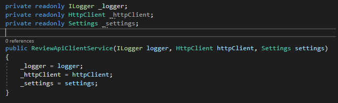

# Lesson 2: Sending messages to a SQS queue

In this lesson, we will rework the Lesson 1 Final BlogPost API solution and send messages to local AWS SQS queue instead of calling directly the Review API. 

The [localstack](https://github.com/localstack/localstack) docker image allows to mock/simulate AWS Services. The Prep folder contains a docker-compose.yml file with a base definition for localstack. We will hen configure it to add a SQS queue when the container is initialized.  

## Setup of Localstack

The `Prep/docker-compose.yml` contains a basic definition of localstack. 

```yml
localstack:
    image: localstack/localstack
    container_name: localstack
    environment:
        - SERVICES=
        - DEFAULT_REGION=eu-west-2
        - HOSTNAME=localstack
    ports:
        - "4566:4566"
```

To create the queue, first add a folder `localstack-config` in Docker folder and include a shell script `init.sh` that creates an AWS queue `request-review-queue` from command line:
    
```sh
aws sqs create-queue --queue-name new-blog-post-queue --region eu-west-2 --endpoint-url http://localstack:4566
```

Since we are not using the real AWS endpoints, we need to specify our endpoint URL in each of our commands. Note that in the init.sh, we are creating the queue from inside the container and the hostname is localstack. When we call our SQS queue from our local machine, we will be using `localhost:4566`. 

The structure should look like:


Then, in the localstack configuration, we need to: 
- Add `sqs` in the SERVICES list
- Add dummy AWS credentials to allow to use the AWS commands inside localstack (to create sqs queues for eg.). Note that localstack has its own [awslocal](https://github.com/localstack/awscli-local) CLI, but we will stick with the classic `aws` ones in our lesson. 
    * AWS_ACCESS_KEY_ID=xxx
    * AWS_SECRET_ACCESS_KEY=xxx
    * AWS_DEFAULT_REGION=eu-west-2
- Add a volume and mount `./docker/localstack-config` to the `/docker-entrypoint-initaws.d`

The final config should look like:
```yml
localstack:
    image: localstack/localstack
    container_name: localstack
    environment:
        - SERVICES=
        - DEFAULT_REGION=eu-west-2
        - HOSTNAME=localstack
        - AWS_ACCESS_KEY_ID=xxx
        - AWS_SECRET_ACCESS_KEY=xxx
        - AWS_DEFAULT_REGION=eu-west-2
    volumes:
        - "./docker/localstack-config:/docker-entrypoint-initaws.d"
    ports:
        - "4566:4566"
```

Then start the docker-compose.yml file:

```
docker-compose up
```

From a command line, you can check that the SQS queue was created successfully:

```sh
aws sqs list-queue --endpoint-url http://localhost:4566 --region eu-west-2
```

Expected result:


Before we send a message into our SQS, let's do a bit of cleaning in the BlogPost code. 

## Refactoring

In Lesson 1, our final solution contained a ReviewApiClientService class and IReviewApiClientService interface, that we used in the BlogPostService. 

Now that we want to be able to send the review request to a queue instead of calling the API directly, we will do a bit of clean up. The code inside the ReviewApiClientService will change but the external behavior from a user perspective and even from the BlogPostService won't be modified. We will reuse the same *contract* ReviewRequest and the signature of the method Post will stay the same. 

Restructuring a piece of code without altering the external behavior is called refactoring. This is an important discipline that is used for improving code readability or code optimisation, and helps to prevent accumulating up technical debt. This technique is safely done when a good unit test project is in place to testify that the *external* behavior has indeed not changed. 

We will be refactoring the code of the ReviewApiClientService class. 

### Step 1: Remove the call to the Review API

In the ReviewApiClientService class, Post method, remove the code as followed:


Without this piece of code, the code should still compile. Your method still returns "True" if the content of the method, now empty, executes successfully, and throw an exception if something goes wrong (which is now very unlikely to happen). From a BlogPostService point of view: nothing has changed at all, the BlogPost API endpoint will still be working and be completely unaware that something has changed. If we had unit tests, the tests around BlogPostService would pass while the ones covering the ReviewApiClientService would fail. 

Visual Studio should have normally greyed out the now unused variables and namespaces. We will need Settings later, but we can now remove the HttpClient. 

Use the shortcut Ctrl R + G to clean the useless namespaces. 



You should still be able to compile like before. 

Note that changing the signature of your constructor didn't break the code thanks to dependency injection, but we won't need the code in `Startup.cs` related to HttpClient, so the IReviewApiClientService injection can be replaced by a simple transient one:


### Step 2: Rename classes, methods & variables

Make sure you still compile, then Right-click on the ReviewApiClientService file and rename to `ReviewRequestSender`. 


And say "yes" to the following question:


This will automatically rename all occurrences of your class. 

Repeat for `ReviewApiClientService` to `IReviewRequestSender`.

Go to `ReviewRequestSender`, right-click on the Post method and click rename (Ctrl R+R)


Type the new name and Apply:


Make sure you saved every opened files and you can still compile.

In BlogPostService.cs class, you will notice that IReviewRequestSender is used in the constructor and that the method call is SendMessage. Since renaming don't consider variable names, change these by right clicking on the variable name and rename as we did for the method name. 

The constructor and Insert method of BlogPostService should look like this by now:

```csharp
public class BlogPostService : IBlogPostService
{
    private readonly IBlogPostDataStore _blogPostDataStore;
    private readonly ILogger _logger;
    private readonly IReviewRequestSender _reviewRequestSender;

    public BlogPostService(IBlogPostDataStore blogPostDataStore, ILogger logger, IReviewRequestSender reviewRequestSender)
    {
        _blogPostDataStore = blogPostDataStore;
        _logger = logger;
        _reviewRequestSender = reviewRequestSender;
    }

    public bool Insert(BlogPost blogPost)
    {
        var (blogPostId, inserted) = _blogPostDataStore.Insert(blogPost);

        if (inserted)
        {
            var reviewRequest = new ReviewRequest()
            {
                BlogPostId = blogPostId,
                Reviewers = new List<string>() // Empty list for now
            };

            var result = _reviewRequestSender.SendMessage(reviewRequest);
            _logger.Information($"Result: {result}");
        }

        return inserted;
    }

    // ...
}
```

### Step 3: Clean up the settings

Lastly, remove the settings for ReviewApiBaseUrl:
- in the Settings class, remove `public string ReviewApiBaseUrl { get; set; }`
- in the appSettings.json, remove `"ReviewApiBaseUrl": "http://localhost:5002"`

Clean up is now done. Let's now send a message to SQS. 

## Send a message to SQS

Posting a message to SQS is basically a HTTP Call like we did with the Review API, however, the AWS SDK for .NET proposes a .NET Library for each of its services to simplify the writing of requests and handling responses. 

> *A SDK (Software Development Kit) is a complete suite of development tools for a given platform, while a library is a list of functions that you can call in your code.*

### Step 1: Install the dependencies

To install the SQS Library, right click on BlogPostApi project, Manage Nuget Packages and select `AWSSDK.SQS`:


When selecting libraries, you select only the ones you really need. The dependencies required by the library will be installed by Nuget for you anyway: 


### Step 2: Update the settings

We will need a couple of settings to add in the Settings class and appSettings.json. All of them are strings:
- **EndpointUrl**: with value `http://localhost:4566`
- **Account**: with value `000000000000`
- **QueueName**: with value `request-review-queue`

### Step 3: Define a SQS Client variable

In the ReviewRequestSender class, we will define a SQS Client private variable and inject it into the constructor.  

```csharp
private readonly ILogger _logger;
private readonly Settings _settings;
private readonly IAmazonSQS _sqsClient;

public ReviewRequestSender(ILogger logger, Settings settings, IAmazonSQS sqsClient)
{
    _logger = logger;
    _settings = settings;
    _sqsClient = sqsClient;
}
```

### Step 4: Configure dependency injection

In the Startup.cs, ConfigureServices method, we will create a new instance of the SqsClient and add it as a singleton like this:
```csharp
// Create config object using the EndpointUrl defined in appSettings
var sqsConfig = new AmazonSQSConfig() {
    ServiceURL = settings.EndpointUrl
};

// Create sqsClient object with this config
var sqsClient = new AmazonSQSClient(sqsConfig);

// Anytime the IAmazonSQS client interface is declared, the same instance of sqsClient we just defined will be used
services.AddSingleton<IAmazonSQS>(sqsClient);
```

### Step 5: Update the SendMessage method

In the SendMessage method: 

```csharp
public bool SendMessage(ReviewRequest request)
{
    try
    {
        // URL built will be http://localhost:4566/000000000000/request-review-queue
        var queueUrl = $"{_settings.EndpointUrl}/{_settings.Account}/{_settings.QueueName}";

        // Serialization of the object
        var jsonRequest = JsonConvert.SerializeObject(request);

        // _sqsClient.SendMessageAsync will make the necessary HTTP connection to our AWS Service
        // Please ignore async here.
        var response = _sqsClient.SendMessageAsync(queueUrl, jsonRequest).GetAwaiter().GetResult();

        // Will throw an exception if invalid status code
        if (response.HttpStatusCode != System.Net.HttpStatusCode.OK)
        {
            throw new Exception($"Invalid status code: {response.HttpStatusCode}");
        }

        _logger.Information($"Call succeeded. Message ID: {response.MessageId}");

        return true;
    }
    catch(Exception ex)
    {
        _logger.Error($"Unknown error {ex.Message}", ex.StackTrace);
        throw;
    }
}
```

Now, the structure of this code should look familiar: 

| API Review HTTP Request | AWS SQS Request |
| ------------- |-------------|
|  |  | 

There are a few differences of course, the SDK proposes some classes & methods to simplify the writing of the AWS calls and give meaningfull names to the actions: but both sample codes are essentially the same thing: a HTTP POST request, whichever libraries/abstractions you choose to use. 

Imagine you want to add message attributes to your request or a delay in seconds like in this shell example: 

```bash
aws sqs send-message \
  --queue-url "http://localhost:4566/000000000000/request-review-queue" \
  --message-body "{BlogPostId:1,Reviewers:[{\"jack\"}]}" \
  --message-attributes 'Metadata={DataType=String, StringValue="48485a3953bb6124"}' \
  --delay-seconds 1 \
  --endpoint-url http://localhost:4566 --region eu-west-2
```

You can use the SendMessageRequest class to help you construct a properly formatted request:

```csharp
var sqsRequest = new SendMessageRequest() { 
    QueueUrl = queueUrl,
    MessageBody = jsonRequest,
    DelaySeconds = 1,
    MessageAttributes = new Dictionary<string, MessageAttributeValue> {
        { "Metadata", new MessageAttributeValue() { DataType = "String", StringValue = "48485a3953bb6124" } }
    }
};
```

And then call with your object:

```csharp
_sqsClient.SendMessageAsync(sqsRequest)
```

### Step 6: Test

With this addition, let's compile and try to add a new BlogPost. 

If your call was successfully, you should now see a message added to your queue:

```bash
aws sqs receive-message \
  --queue-url "http://localhost:4566/000000000000/request-review-queue" \
  --endpoint-url http://localhost:4566 --region eu-west-2
```


This lesson is finished, on the next one, we will create a worker service that will process messages from this queue as soon as there are made available. 