# Lesson 3: Receiving & Processing messages from a SQS queue

In this lesson, we will create a simple background service whose only role will be to listen for messages to come to the queue, and send the Review API in behalf of the BlogPost API. 

Start the `docker-compose` if you haven't done it yet. 

## Create a background/worker service

1. Open Visual Studio 
2. Select "Create a new project" 
3. Search for Blank Solution

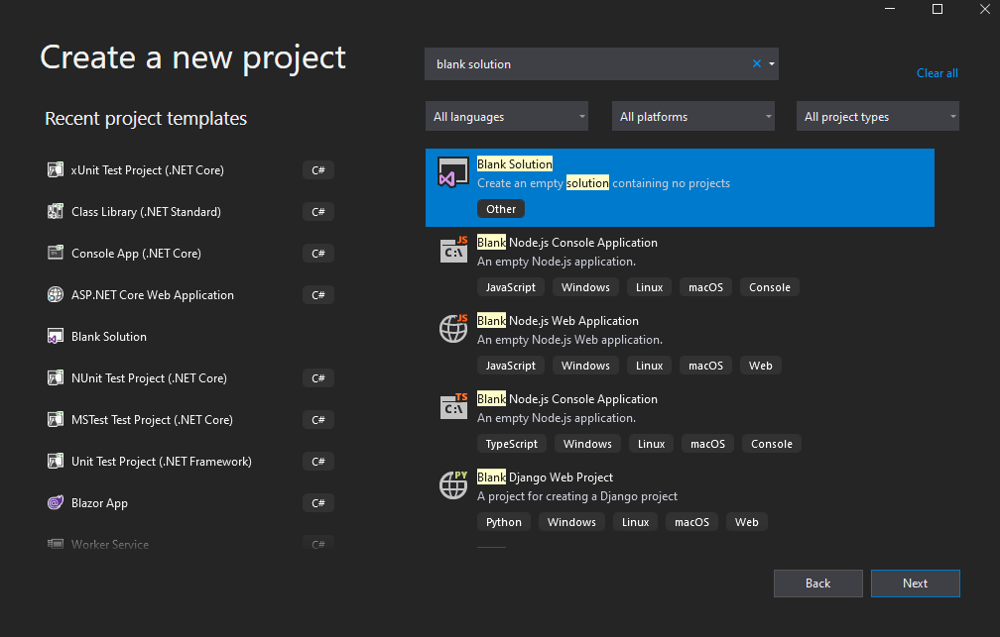

4. Call the Solution `RequestReviewProcessor` and select the folder location you want to keep your solution. Then Create
5. Right-click on the Solution, Add, New Project

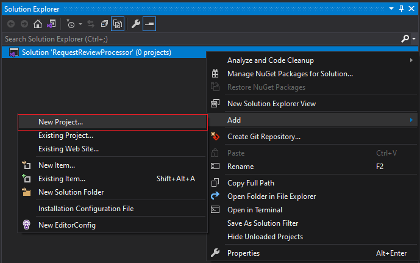

6. Search for Worker Service and next

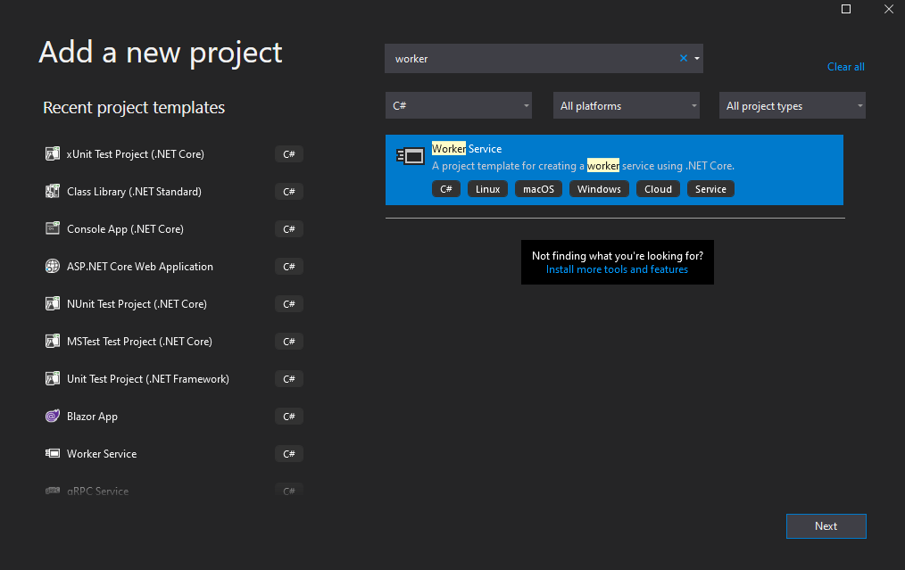

7. Rename it to `RequestReviewProcessor` and make sure the preselected location is correct. Then Create
8. Select the version .NET Core of your choice, here 3.1, and keep no auth / no docker setup. Then Create again.

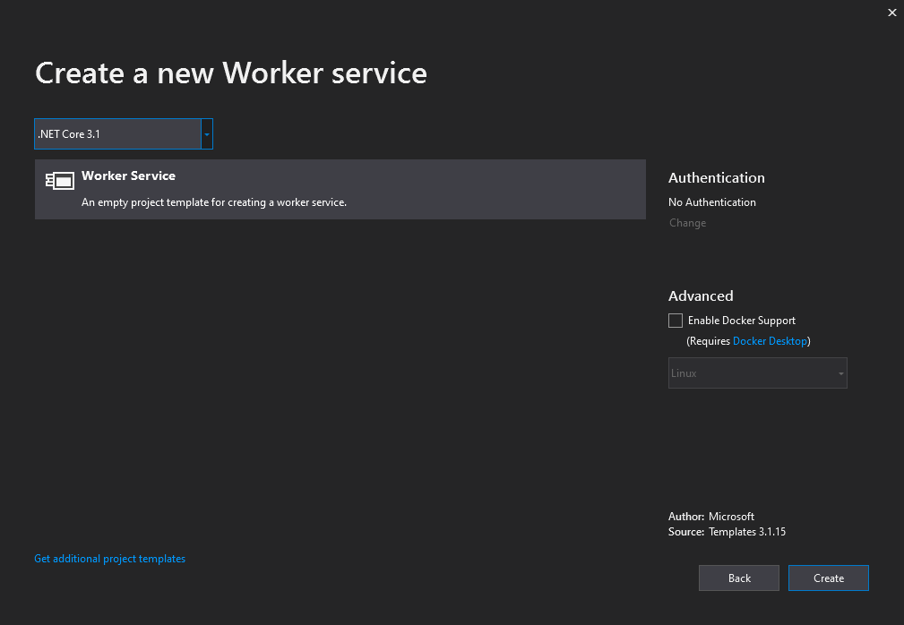

The solution should look like this: 

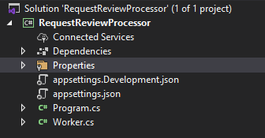

We won't need appsetting.Development.json here, so it can be removed.

There are only two files in this template: `Program.cs` and `Worker.cs`.

We have already met `Program.cs` in the API projects, with its main method. I recommend you compare the two contents. Here, we do not defined a startup method, and the method ConfigureServices is called directly by the `Host`. Notice that here, *`services.AddHostedService<Worker>();`* is adding our worker class as an hosted service. A single instance of this worker will run in background (in its own *thread*), when our console application is started. This will allow for the worker to listen *continuously* for new messages. 

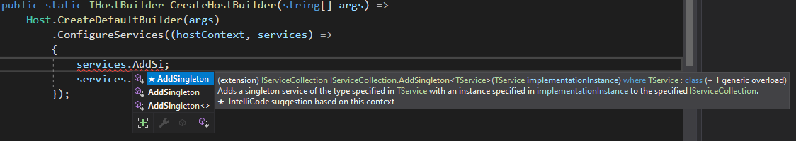

If you type `services.` and CTRL-Enter, you will notice that you are familiar with the methods propose.  

The second class is the Worker:

```csharp
public class Worker : BackgroundService
{
    private readonly ILogger<Worker> _logger;

    public Worker(ILogger<Worker> logger)
    {
        _logger = logger;
    }

    protected override async Task ExecuteAsync(CancellationToken stoppingToken)
    {
        // run until application stops
        while (!stoppingToken.IsCancellationRequested)
        {
            // Log some info
            _logger.LogInformation("Worker running at: {time}", DateTimeOffset.Now);

            // Waiting a second (1000ms) 
            await Task.Delay(1000, stoppingToken);
        }
    }
}
```

The Worker class implements a single method `ExecuteAsync`, which is going to run some code in a loop. This loop runs until a "cancellation token" is requested (when the application is stopped by the user (CTRL+C)).

If you run this application, you will see that its logging an entry every second in the console.

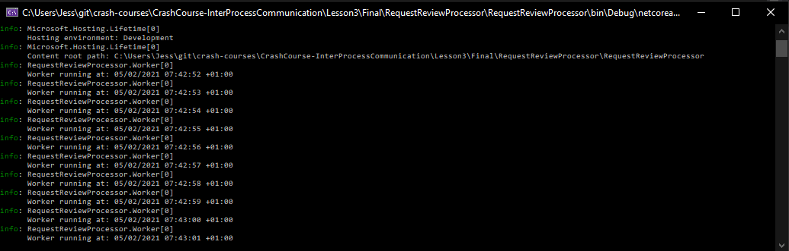

## Interlude: inheritance & C# keywords

Back to the `Worker` class.

The `Worker` class inherits from a .NET Core `BackgroundService`. If you right-click on the BackgroundService and go to Definition, you will have a description of this *base class*. 

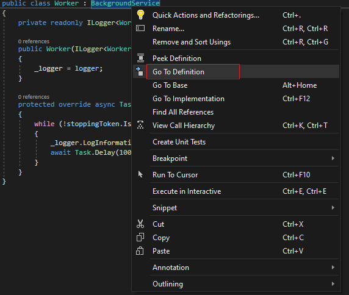

The BackgroundService *abstract* class contains 4 methods:
- Dispose public virtual method
- StartAsync public virtual method
- StopAsync public virtual method
- ExecuteAsync protected abstract method

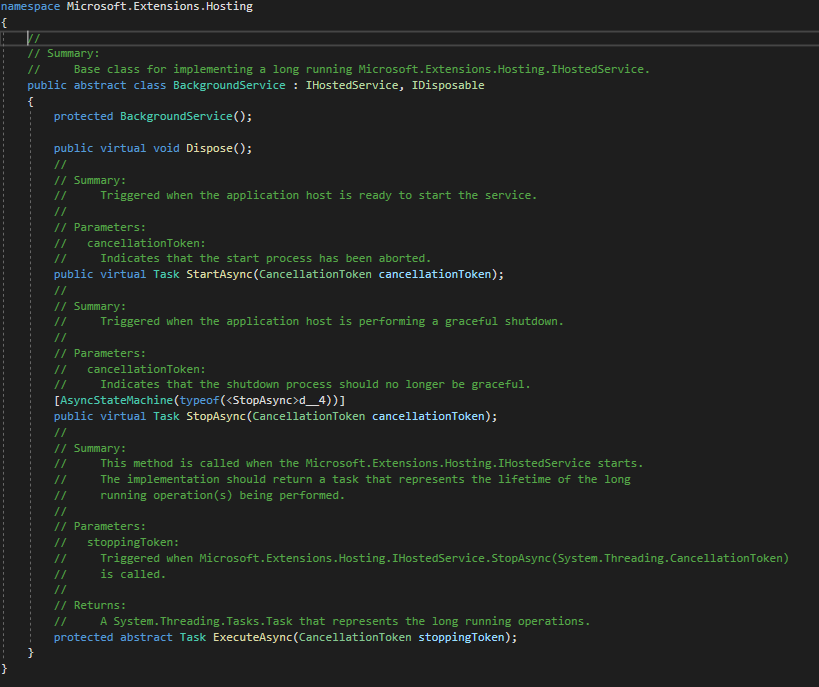

### Inheritance

We haven't spoken about inheritance yet in the course so let's have a look now. 

The syntax looks similar to the BlogPostService interface implementation but inheritance has other characteristics.

```csharp
public class BlogPostService : IBlogPostService
{
    // BlogPostService implements method defined in the IBlogPostService interface  
}
```

Inheritance is an important concept of any Oriented-Object Programming (OOP) language like C#. It consists of defining a base class (parent) that provides a set of variables, properties & methods, that other (child) classes can *derived* from. 

To illustrate, let's take a simpler example. Let's say you want to represent into your application the concept of Cars & Buses. `Bus` and `Car` have common features such as `circulate in a road` or `a valid MOT`, and some specific features such as its size or horsepower. To avoid repeating the common features, you can isolate them into a base class `Vehicle` that `Bus` and `Car` can inherit from.

> *Inheritance often comes with the exotic concept of "polymorphism" but I will let you check an "Oriented Object Programming" course or "Top 100 C# interview questions" instead!*

In a more pragmatic way, we use base classes to enforce expected structure & behaviors for child classes. All classes deriving from BackgroundServices must have some ExecuteAsync content to execute and optionally some start and stop actions: the framework that handles background services behind the scenes knows what to expect of any instances created from a derived class. 

When a base class is defined, you can still *override* some of the behavior in the child class and this is what `public virtual` and `protected abstract` methods are for here. All 4 methods can be overriden of BackgroundService can be overriden, but only the `protected abstract ExecuteAsync` MUST be defined. 

### `public` / `protected` access modifiers keywords

So far, we defined private members (variables) and public methods when needed but didn't details what that means. `public`, `protected`, `internal` and `private` are called "access specifiers":
- `public` members or methods are accessible from outside the class
- `private` members or methods are accessible only from the class itself
- `protected` members or methods are accessible only by the class and its derived classes
- `internal` members or methods are accessible in the same assembly (I won't detail that here)

You should not give power to other classes to mess up with your internal object state. In the following example, `_settings` was made `public` instead of `private`. The BlogPostService can now change the state of the Settings instance by changing the QueueUrl for instance. 

```csharp
public class ReviewRequestSender : IReviewRequestSender
{
    public Settings _settings;

    // ...
}

public class BlogPostService : IBlogPostService
{
    private readonly IReviewRequestSender _reviewRequestSender;

    public  bool Insert(BlogPost blogPost) {
        _reviewRequestSender._settings.QueueUrl = "http://my-new/url";
        // ...
    }
}
```

You are the one who codes here, so corrupting your own code might not make much sense. But imagine you have a more complex code and another coder needs to use a different queue URL for another method in another class... (another x3). It does not have to be intentional, if the variable visible, this gives the wrong message that the variable can be modified safely:

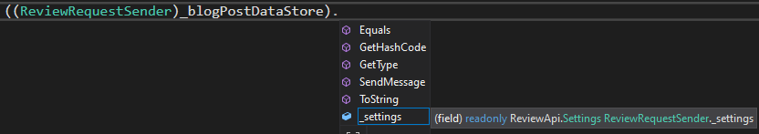

Don't let opportunity for things to go wrong, use `private` members/methods as a default and only allow access to what you really need to. 

### `virtual` / `abstract` / `override` modifier keywords

The difference betweent the two is as simple as this:
- Virtual methods have an implementation defined in the base class, and allow the derived classes to override them. 
- Abstract methods do not so that forces the derived classes to provide one.

When a `virtual` and `abstract` method is overriden in the derived class, the keyword `override` must be used:

```csharp
public class Worker : BackgroundService
{
    public override Task StartAsync(CancellationToken cancellationToken)
    {
        // ...
    }

    protected override Task ExecuteAsync(CancellationToken stoppingToken)
    {
        // ...
    }
}
```

## Update the Worker class

### Step 1: Replace the logging library

In the BlogPost API we used the Serilog library for logging. Ideally, all our services should send logs to the same place.
If you need more details about this process, check out the CrashCourse-API Lesson 4 "C. Using an external logger". 

1. Install `Serilog`, `Serilog.Settings.Configuration`,`Serilog.Sinks.Seq` nuget packages. Add `Serilog.Sinks.Console` if you want the logs to also appear in the console.
2. Replace `Logging` section in appSettings by : 

```json
"Serilog": {
    "WriteTo": [
        {
            "Name": "Seq",
            "Args": { "serverUrl": "http://localhost:5341" }
        },
        {
            "Name": "Console"
        }
    ]
}
```

3. In Program.cs, add the following code to the ConfigureService:

```csharp
var logger = new LoggerConfiguration()
    .ReadFrom.Configuration(hostContext.Configuration)
    .CreateLogger();

services.AddSingleton<ILogger>(logger);
```

4. In Worker.cs:
- replace `Microsoft.Extensions.Logging` by `Serilog` namespace. 
- replace ILogger<Worker> by ILogger. 
- replace `LogInformation` method by `Information`. 

5. Run and check SEQ: http://localhost:5341/#/events

Your logs should now appear in SEQ every seconds:

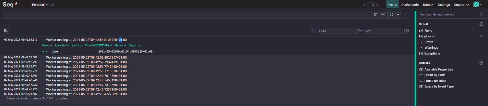

If you have multiple service sending data to SEQ, the logs might become difficult to read. 
You can specific attributes when sending logs, such as the service name: 

6. Add attributes for service name

```csharp
_logger.Information("{ServiceName} Worker running at: {time}", _settings.ServiceName, DateTimeOffset.Now);
```

You can then filter your logs by service:

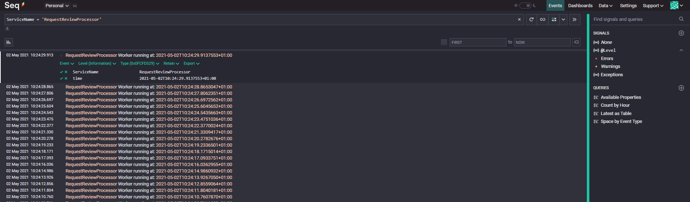

### Step 3: Setup SQS Client & Settings

Similarly to the setup in Lesson 2 to send SQS messages, we will:

1. Add the Settings class & appSettings SQS configurations
2. Install the AWSSDK.SQS Library
3. Create an IAmazonSqs Client to inject it in your Worker

Give a try by yourself and then check the files:

<details>
<summary>Worker.cs</summary>
<p>

```c#
using Amazon.SQS;
using Microsoft.Extensions.Hosting;
using Serilog;
using System;
using System.Threading;
using System.Threading.Tasks;

namespace RequestReviewProcessor
{
    public class Worker : BackgroundService
    {
        private readonly ILogger _logger;
        private readonly IAmazonSQS _sqsClient;
        private readonly Settings _settings;

        public Worker(ILogger logger, Settings settings, IAmazonSQS sqsClient)
        {
            _logger = logger;
            _settings = settings;
            _sqsClient = sqsClient;
        }

        protected override async Task ExecuteAsync(CancellationToken stoppingToken)
        {
            while (!stoppingToken.IsCancellationRequested)
            {
                _logger.Information("Worker running at: {time}", DateTimeOffset.Now);
                await Task.Delay(1000, stoppingToken);
            }
        }
    }
}
\```
</p>
</details> 

<details>
<summary>Settings.cs</summary>
<p>

```c#
namespace RequestReviewProcessor
{
    public class Settings
    {
        public string ServiceName { get; set; }

        public string EndpointUrl { get; set; }

        public string Account { get; set; }

        public string QueueName { get; set; }
    }
}
\```
</p>
</details> 

<details>
<summary>Program.cs</summary>
<p>

```c#
using Amazon.SQS;
using Microsoft.Extensions.Configuration;
using Microsoft.Extensions.DependencyInjection;
using Microsoft.Extensions.Hosting;
using Serilog;

namespace RequestReviewProcessor
{
    public class Program
    {
        public static void Main(string[] args)
        {
            CreateHostBuilder(args).Build().Run();
        }

        public static IHostBuilder CreateHostBuilder(string[] args) =>
            Host.CreateDefaultBuilder(args)
                .ConfigureServices((hostContext, services) =>
                {
                    // Configure AppSettings
                    var settings = hostContext.Configuration.GetSection("Settings").Get<Settings>();
                    services.AddSingleton(settings);

                    // Configure SEQ Logging
                    var logger = new LoggerConfiguration()
                        .ReadFrom.Configuration(hostContext.Configuration)
                        .CreateLogger();
                    services.AddSingleton<ILogger>(logger);

                    // Configure SQS Client
                    services.AddSingleton<IAmazonSQS>(new AmazonSQSClient(new AmazonSQSConfig() { ServiceURL = settings.EndpointUrl }));

                    // Configure Background Service
                    services.AddHostedService<Worker>();
                });
    }
}
\```
</p>
</details> 


<details>
    <summary>appsettings.json</summary>
        <p>

        ```json
        {
            "Settings": {
                "ServiceName": "RequestReviewProcessor",
                "EndpointUrl": "http://localhost:4566",
                "Account": "000000000000",
                "QueueName": "request-review-queue"
            },
            "Serilog": {
                "WriteTo": [
                {
                    "Name": "Seq",
                    "Args": { "serverUrl": "http://localhost:5341" }
                },
                {
                    "Name": "Console"
                }
                ]
            }
            }

        \```
   </p>
</details>


### Step 4: Receive messages from the SQS queue

When reading messages from the SQS queue, we will potentially read multiple messages at the same time. As such, we will just iterate on each messages and process them individually. Another characteristics of Amazon SQS is that you need to delete the message explicitly so it is not processed by your worker. 

The code of the `ExecuteAsync` will look as below. We won't do anything yet with the message. 

```csharp
protected override async Task ExecuteAsync(CancellationToken stoppingToken)
{
    var queueUrl = $"{_settings.EndpointUrl}/{_settings.Account}/{_settings.QueueName}";

    while (!stoppingToken.IsCancellationRequested)
    {
        try
        {
            // Create Receive Message Request 
            var receiveMessageRequest = new ReceiveMessageRequest()
            {
                QueueUrl = queueUrl
            };

            // Call the Receive-Message AWS Commands
            var receiveMessageResponse = await _sqsClient.ReceiveMessageAsync(receiveMessageRequest, stoppingToken);

            // For each message received in the batch 
            foreach (var message in receiveMessageResponse.Messages)
            {
                // Log the message ID
                _logger.Information("{ServiceName}: Message {MessageId} received", _settings.ServiceName, message.MessageId);

                /// TODO: Do something interesting with the message

                // After processing the message, delete it from the queue (otherwise it will be reprocessed)
                await _sqsClient.DeleteMessageAsync(new DeleteMessageRequest()
                {
                    QueueUrl = queueUrl,
                    ReceiptHandle = message.ReceiptHandle
                }, stoppingToken);
            }

            // Wait 1 seconds before next receive command
            await Task.Delay(1000, stoppingToken);
        }
        catch (Exception ex)
        {
            _logger.Error(ex, ex.Message);
            // Wait 10 seconds before next receive command
            await Task.Delay(10000, stoppingToken);
        }
    }
}
```

> *Note: If you compare with your BlogPostAPI Sender code, you will find that I am not calling `GetAwaiter().GetResult()` and I am passing a `stoppingToken` as parameter of the AWS Library. In my ExecuteAsync method, we can make **async**hronous calls and **await** using the relevant keywords. We can also stop a request half-way through by cancelling it if my application stops for instance. While .NET core will deal with this differently internally, what you see from outside looks the same so I won't discuss it much further there.*

If you run your application now and messages are available on the queue, you will see the following logs in SEQ:

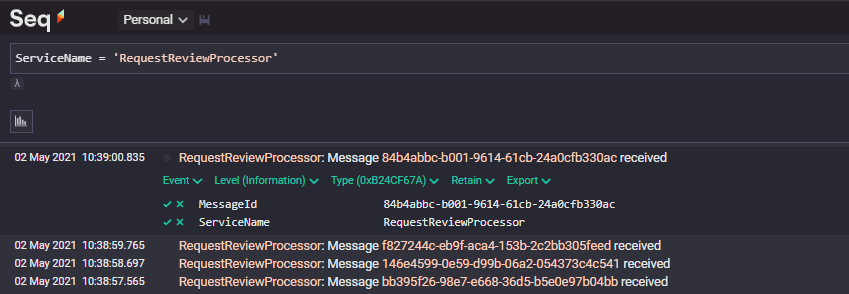

If you don't have messages in the queue, start the BlogPostAPI from the previous lesson and create some blog posts. You will see the worker process them as they appear. 

Now, stop the worker and keep adding some messages by creating blog posts:
- Even if the worker is not available, your BlogPostAPI can still make those requests
- When you restart your worker, it will pick up all the messages which appeared in the queue while being unavailable/disconnected. No messages will be lost.

### Step 5: Process the message

Similarly to the layers in the API, we will split the `MessageHandlers` / `Processor` from the main worker. This is to separate different concerns and help unit testing. The Handler does not care which queuing technology is chosen, it could be SQS or another, this will not change the behavior when processing the content of the messages. 

1. Create a folder `Handlers`
2. Create an interface `IMessageHandler` and a class `MessageHandler` implement the interface (both public)
3. Create a folder `Contracts`
4. Create a class `ReviewRequest` in `Contracts` folder
5. Copy the content of `ReviewRequest` contracts, available in the BlogPostAPI (/Contracts/ReviewRequest.cs)
6. Configure dependency injection in `Program.cs`

```csharp
services.AddSingleton<IMessageHandler, MessageHandler>();
```

For the implementation: 

1. In the `MessageHandler` class, add private variables for Settings and ILogger and inject them in the constructor

```csharp
private readonly ILogger _logger;
private readonly Settings _settings;

public MessageHandler(ILogger logger, Settings settings)
{
    _logger = logger;
    _settings = settings;
}
```

2. In the `IMessageHandler` interface, define a method:

```csharp
Task<bool> ProcessMessageAsync(ReviewRequest request, CancellationToken cancellationToken);
```

3. Implement it in `MessageHandler`

```csharp
public Task<bool> ProcessMessageAsync(ReviewRequest request, CancellationToken cancellationToken)
{
    _logger.Information("{ServiceName}: Blog Post {BlogPostId} Request Review received", _settings.ServiceName, request.BlogPostId);

    // Ignore this for now.
    return Task.FromResult(true);
}
```

4. In the `Worker` class, add a `IMessageHandler` variable and pass it through the constructor
5. Still in `Worker` class, replace the `/// TODO` by

```csharp
// Deserialize the content of the message (string -> object)
var requestReview = JsonConvert.DeserializeObject<ReviewRequest>(message.Body);
// Pass it through the Process Message method
await _messageHandler.ProcessMessageAsync(requestReview, stoppingToken);
```

The result in SEQ should look like: 

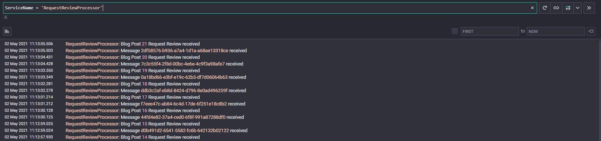

### Step 6: Call the Review API

Let's do a bit of copy-pasting for the Review API call. 

From Lesson 1, Final folder, copy the content of Post method used to call the Review API [ReviewApiClientService.cs](Lesson1\Final\BlogPost\BlogPostApi\Services\ReviewApiClientService.cs) and paste into `ProcessMessageAsync` of `MessageHandler`.

Copy the namespaces from the `ReviewApiClientService` and append to the ones in `MessageHandler`: CTRL R+G to remove duplicates and broken references. 

<details>
    <summary>MessageHandler.cs</summary>
        <p>

        ```csharp
        using Newtonsoft.Json;
        using RequestReviewProcessor.Contracts;
        using Serilog;
        using System;
        using System.Net.Http;
        using System.Text;
        using System.Threading;
        using System.Threading.Tasks;

        namespace RequestReviewProcessor.Handlers
        {
            public class MessageHandler : IMessageHandler
            {
                private readonly ILogger _logger;
                private readonly Settings _settings;

                public MessageHandler(ILogger logger, Settings settings)
                {
                    _logger = logger;
                    _settings = settings;
                }

                public Task<bool> ProcessMessageAsync(ReviewRequest request, CancellationToken cancellationToken)
                {
                    _logger.Information("{ServiceName}: Blog Post {BlogPostId} Request Review received", _settings.ServiceName, request.BlogPostId);

                    try
                    {
                        var uri = new Uri($"{_settings.ReviewApiBaseUrl}/api/review");

                        var requestBody = new StringContent(
                            JsonConvert.SerializeObject(request),
                            Encoding.UTF8,
                            "application/json"
                        );

                        var response = _httpClient.PostAsync(uri, requestBody).GetAwaiter().GetResult();

                        var content = response.Content.ReadAsStringAsync().GetAwaiter().GetResult();

                        response.EnsureSuccessStatusCode();

                        _logger.Information($"Call succeeded. Content Request: {content}");
                        return true;
                    }
                    catch (Exception ex)
                    {
                        _logger.Error($"Unknown error {ex.Message}", ex.StackTrace);
                        throw;
                    }

                    return Task.FromResult(true);
                }
            }
        }

        \```
   </p>
</details> 

At this point, the compiler should complain (and tell you what to do): 

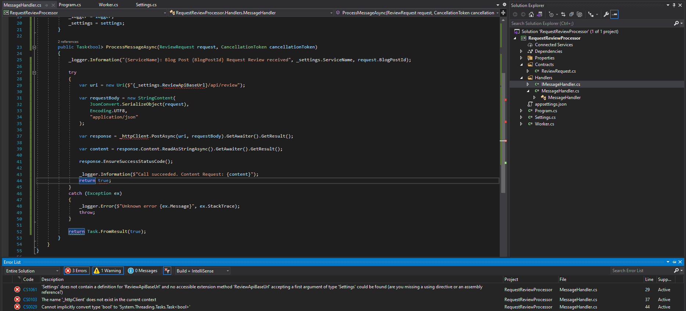

Let's check all errors: 

> 'Settings' does not contain a definition for 'ReviewApiBaseUrl' and no accessible extension method 'ReviewApiBaseUrl' accepting a first argument of type 'Settings' could be found (are you missing a using directive or an assembly reference?)

The base URL of Review API is `http://localhost:5002`:

<details>
    <summary>Solution</summary>
    <ul>
        <li>Add a `ReviewApiBaseUrl` string variable in Settings.cs file.</li>
        <li>Add a `ReviewApiBaseUrl` with value `http://localhost:5002` in `Settings` section in appsettings.json.</li>
    </ul>
</details> 

> The name '_httpClient' does not exist in the current context

We need to inject the HTTP Client like we did for `ReviewApiClientService` (we do not need Polly here, since the retry is handled by SQS so you can skip this configuration).

Add `Microsoft.Extensions.Http` nuget package to avoid any trouble.

<details>
<summary>Configure HTTP Client in Program.cs</summary>
<p>

```c#
services
    .AddHttpClient<IMessageHandler, MessageHandler>(client =>
    {
        client.BaseAddress = new Uri(settings.ReviewApiBaseUrl);
    });
\```
</p>
</details> 
<details>
<summary>Add HttpClient as private variable and in the constructor of MessageHandler</summary>
<p>

```c#
private readonly ILogger _logger;
private readonly Settings _settings;
private readonly HttpClient _httpClient;

public MessageHandler(ILogger logger, Settings settings, HttpClient httpClient)
{
    _logger = logger;
    _settings = settings;
    _httpClient = httpClient;
}
\```
</p>
</details> 

> Cannot implicitly convert type 'bool' to 'System.Threading.Tasks.Task<bool>'

This issue is due to the async/await behavior that were mentioned earlier in this lesson. 

1. Remove `return Task.FromResult(true);`
2. Add the keyword `async` between `public` and `Task<bool>` in your method

At this point, the compiler will stop complaining, but let's clean the asynchronous code anyway:

3. Instead of `_httpClient.PostAsync(uri, requestBody).GetAwaiter().GetResult()`, use `await _httpClient.PostAsync(uri, requestBody)`
4. Instead of `response.Content.ReadAsStringAsync().GetAwaiter().GetResult()`, use `await response.Content.ReadAsStringAsync()`

There should be no more issue now. Let's just make the information/error log more informative before we run.
- `_logger.Information("{ServiceName}: Call succeeded. Content Request: {content}", _settings.ServiceName, content);`
- `_logger.Error("{ServiceName}: Unknown error {Message}", _settings.ServiceName, ex.Message, ex.StackTrace);`

ProcessMessageAsync should now look like this:

```csharp
public async Task<bool> ProcessMessageAsync(ReviewRequest request, CancellationToken cancellationToken)
{
    _logger.Information("{ServiceName}: Blog Post {BlogPostId} Request Review received", _settings.ServiceName, request.BlogPostId);

    try
    {
        var uri = new Uri($"{_settings.ReviewApiBaseUrl}/api/review");

        var requestBody = new StringContent(
            JsonConvert.SerializeObject(request),
            Encoding.UTF8,
            "application/json"
        );

        var response = await _httpClient.PostAsync(uri, requestBody);

        var content = await response.Content.ReadAsStringAsync();

        response.EnsureSuccessStatusCode();

        _logger.Information("{ServiceName}: Call succeeded. Content Request: {content}", _settings.ServiceName, content);
        return true;
    }
    catch (Exception ex)
    {
        _logger.Error("{ServiceName}: Unknown error {Message}", _settings.ServiceName, ex.Message, ex.StackTrace);
        throw;
    }
}
```

### Step 7: Start the Review API & Run Worker

We now have a dependency between our SQS message Worker and Review API. If the Review API is unavailable, the Worker will just let the message in the queue and retry when the Review API is back online. 

Let's start the Review API solution from the [Lesson1\Prep\Review folder](Lesson1\Prep\Review) and run the API.

Now start the Worker, create few blog posts and check SEQ:

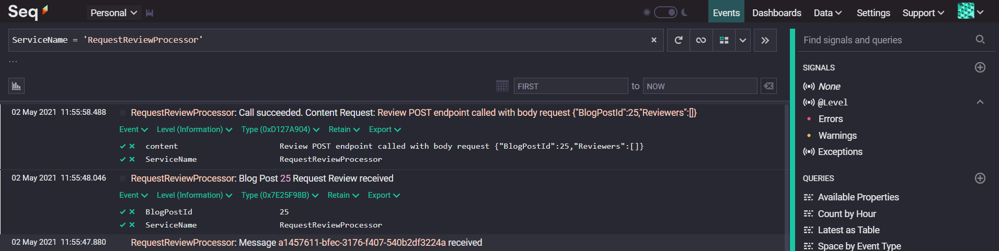

If everything goes well, we should now be processing the messages properly. 

Stop the Review API, and create few more blog posts. The Worker should show errors and retry to process the same message (every 10s as specified when an exception is caught): 

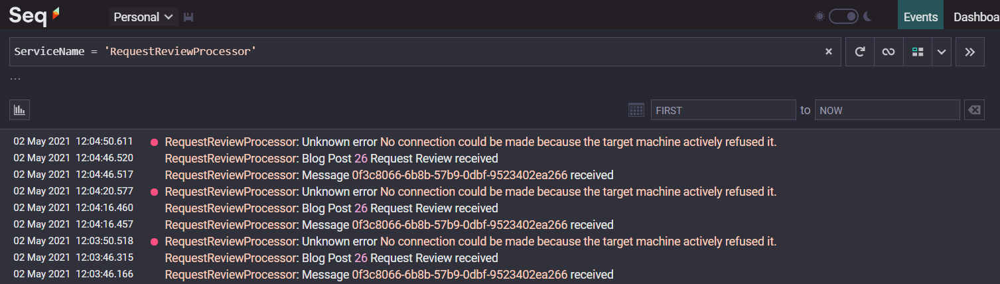

If you restart the Review API, the message should now be processed successfully:

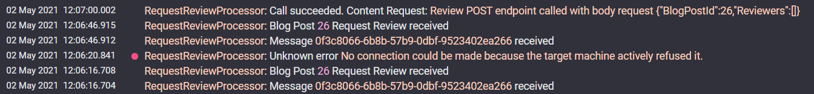

## Conclusion

This concludes the Crash Course on inter-process communication. 

In the first lesson we called the Review API from the Blog Post API and explained the technical challenge of direct RPC calls between APIs. In Lesson 2, we used a local Amazon SQS queue to decouple the two APIs. Lastly, we created a background / worker service, that reads the messages from the SQS queue and call the Review API on behalf of the Blog Post API. 

I hope you learnt tons with this Crash Course! Let me know if any suggestions, feedbacks or issues with this course!
