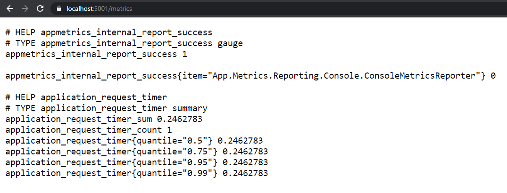
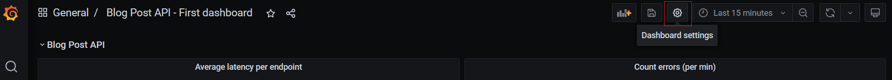

# Lesson 4: Adding application metrics & monitoring [BONUS]

The more services you had into your distributed system, the more difficult it becomes to monitor it through just the logs. Decoupling helps with service scalability, availability and reliability, but it also makes the investigations of issues way harder. Being able to monitor the health of your services becomes primordial in this context. 

You won't be able to prevent all failures from happening, but you can be better equipped to deal with them. Adding application metrics, such as measuring the average duration of calling an API endpoint or counting the number of unexpected errors that occur, help to define what's normal behaviour from a not-so one, and having a "baseline" to compare against. 

In this Bonus lesson, we will start all 3 services created/updated in the previous lessons. The ./Prep folder contains everything you need to get started:
- BlogPost API
- Review API
- RequestReviewProcessor Background Service

As well as an updated docker-compose file, that contains a docker setup for Prometheus (App Metrics collector) and Grafana (Dashboard). 

To get started, run the `docker-compose up` command in the ./Prep folder.

## Prometheus & Grafana Monitoring Systems

[Prometheus](https://prometheus.io/docs/introduction/overview/#architecture) collects application metrics by looking at an `/metrics` endpoint exposed by your applications (targets). The Prometheus server jobs will pull metrics of your targets every x seconds. 

In this lesson, Prometheus will run in a docker contain and all applications will run locally. In a real-life setup where the address IPs of your services might be dynamic, you would need a discovery service mechanism to refresh the target's configurations when needed. 

The metrics in Prometheus can be queried from the server using [PromQL](https://prometheus.io/docs/prometheus/latest/querying/basics/), but to visualize them in a user-friendly dashboard, you would need a proper tool,

For .NET applications, Prometheus integrates with [AppMetrics](https://www.app-metrics.io/getting-started/), a standard library for managing application metrics.

If your docker containers are running already, go to http://localhost:9090.

[Grafana](https://grafana.com/docs/grafana/latest/dashboards/?pg=docs) is used for creating dashboards and alerts. The integration with Prometheus is quite simple and a docker image is available for it. 

Other data sources are available, amongst DataDog and Amazon CloudWatch.

If your docker containers are running already, go to http://localhost:3000. Username: admin, Password: securitymatters123.

Check that the Prometheus DataSource was configured properly by clicking on the data source and then "Save and Test" in the edit form. The message should be "Data source is working".


In this docker setup, Prometheus and Grafana use configuration files defined in the `./Docker` folder. Check the docker-compose container definitions for more information.

When our services will be set up, we will update the `prometheus.yml` file and restart the Prometheus container. 

## Setup of AppMetrics in the APIs

Both Blog Post API & Review API will need the same setup so we will only cover the Blog Post API here.

Open the Blog Post API solution.

### Step 1: Use App.Metrics to report metrics to the console

1. Install `App.Metrics` & `App.Metrics.Reporting.Console` Nuget Package.

2. Configure the AppMetrics service. In your Startup.cs, add the following code in the ConfigureServices method along with all your services.

```csharp
// Creation of a metrics root object
var metrics = new MetricsBuilder()
                    .Report.ToConsole() // Add Reporting to Console
                    .Build();
// Add singleton metrics root object 
services.AddSingleton<IMetrics>(metrics);
```
3. Inject the metrics root object in the BlogPostController (`IMetrics _metrics`)

4. Use `_metrics` in the "GET" endpoint: 

```csharp
// GET: api/<BlogPostController>
[HttpGet]
public IActionResult Get()
{
    // Specifications of what to measure
    var requestTimer = new TimerOptions
    {
        Name = "Request Timer",
        MeasurementUnit = Unit.Requests,
        DurationUnit = TimeUnit.Milliseconds,
        RateUnit = TimeUnit.Milliseconds
    };

    // Starting a timer, which will be stopped when `time` is disposed.
    using (var time = _metrics.Measure.Timer.Time(requestTimer))
    { 
        // Content of the GET endpoint

        var blogPostEntities = _blogPostService.GetAll();

        if (blogPostEntities == null)
            return StatusCode(503);

        return Ok(blogPostEntities.Select(x => new BlogPostResponse()
        {
            Id = x.Id,
            Title = x.Title,
            Content = x.Content,
            CreationDate = x.CreationDate
        }));
    }
}
```

If you run the API at this point, nothing happens. 

The metrics data is not pushed to the Console directly but "buffered" in memory. The main reason is that any instructions (such as logging data in console) takes "time", a very small amount here, but still, we do not want to slow down our endpoint for monitoring. 

For the metrics data to be pushed to the console, we need an independent thread. A thread allows to divide a program into multiple running tasks: it will execute in parallel of your main code and let the API available for other requests (in the main thread). Similarly to having a background/hosted service (cf. RequestReviewProcessor), we need a running task in the background that deals with pushing the data to the console. Fortunately, the code is much simpler, and we can keep it "inline". 

Below the configuration of your appMetrics service, add the following code: 

```csharp
// Add a scheduler task that will run every 10s to send the report to the Console
var scheduler = new AppMetricsTaskScheduler(TimeSpan.FromSeconds(10), 
    async () => {
        await Task.WhenAll(metrics.ReportRunner.RunAllAsync());
    });
scheduler.Start();
```

If you run the application now, it should start sending "reports" even if you haven't called yet your endpoint.


And when you triggered your endpoint, it will start changing those metrics:


As you can see, along with the time of the last request, some statistics are also computed (99th, 95th percentile, mean...). 

Having the metrics data in the Console makes it as readable as in a logging system and we can't do analyze/visualize them like this. Our Prometheus integration requires that the application exposes an endpoint `/metrics` so let's configure one. 

### Step 2: Expose a /metrics endpoint

1. Install the `App.Metrics.AspNetCore.Endpoints` Nuget Package.
2. In the Startup.cs file, `ConfigureServices` method, replace `services.AddSingleton<IMetrics>(metrics);` call with: 

```csharp
// Metrics-related
services.AddMetrics(metrics);
services.AddMetricsEndpoints();

// Writing synchronous calls won't work without changing this global setting:
services.Configure<KestrelServerOptions>(options =>
{
    options.AllowSynchronousIO = true;
});
```

3. Still in the Startup.cs file, `Configure` method this time, add the following code one line before the `app.UseEndpoints(...)` call.

```csharp
app.UseMetricsAllEndpoints();
```

4. Run your application and go to the metrics endpoint `https://localhost:5001/metrics`


### Step 3: Prometheus integration

Now that we exposed a metrics endpoint, we need to convert the format to be readable by the Prometheus server. We will use the plain-text output format. 

1. Install `App.Metrics.Prometheus` Nuget Package
2. Reconfigure the metrics root (ConfigureServices method), as `OutputMetrics.AsPrometheusPlainText()`

```csharp
var metrics = new MetricsBuilder()
    .Report.ToConsole()
    .OutputMetrics.AsPrometheusPlainText()
    .Build();
```

3. Run your application and go to the metrics endpoint `https://localhost:5001/metrics`



### Step 4: Remove the reports to the console

Now that our metrics endpoint is ready, we can remove the reporting to the Console.

In ConfigureServices, remove `.Report.ToConsole()` and `AppMetricsTaskScheduler`

### Step 5: Add Metrics Tags

Right now, our metrics do not contain much data to identify which application and endpoint have been called. When you have a lot more metrics coming from different applications, you will have to know the origin of your metrics.

To do this, we can add tags to our metrics, which will be used to filter them.

We can add Global Tags, such as the ServiceName:

```csharp
var metrics = new MetricsBuilder()
    .Configuration.Configure(opt => {
        opt.GlobalTags.Add("service", settings.ServiceName);
    })
    .OutputMetrics.AsPrometheusPlainText()
    .Build();
```

Back in BlogPostController class, where TimerOptions was defined, we can add tags. The syntax is a bit unusual with keys and values being defined separately:

```csharp
var requestTimer = new TimerOptions
{
    Name = "Request Timer",
    MeasurementUnit = Unit.Requests,
    DurationUnit = TimeUnit.Milliseconds,
    RateUnit = TimeUnit.Milliseconds,
    Tags = new MetricTags(new string[] { "resource" }, new string[] { "blog-post" })
};
```

We can also pass tags in the measure setup: 

```csharp
using (var time = _metrics.Measure.Timer.Time(requestTimer, new MetricTags(new string[] { "call-type" }, new string[] { "datastore" })))
{

}
```

The TimerOptions can be a unique static object, reused for all endpoints. By setting it static, we can reduce the size of the code slightly, remove memory allocations and standardize our metrics (always use ms for instance). Also, you can add a method to simplify the syntax.

```csharp
private readonly static TimerOptions _timerOptions = new TimerOptions
{
    Name = "Request Timer",
    MeasurementUnit = Unit.Requests,
    DurationUnit = TimeUnit.Milliseconds,
    RateUnit = TimeUnit.Milliseconds,
    Tags = new MetricTags(new string[] { "resource" }, new string[] { "blog-post" })
};

private MetricTags AddEndpointName(string endpointName) => new MetricTags(new string[] {"endpoint"}, new string[] {endpointName});

[HttpGet]
public IActionResult Get()
{
    using (var time = _metrics.Measure.Timer.Time(_timerOptions, AddEndpointName("get-all")))
    { 
        //...
    }
}

 [HttpGet("{id}")]
public IActionResult Get(int id)
{
    using (var time = _metrics.Measure.Timer.Time(_timerOptions, AddEndpointName("get-by-id")))
    { 
        //...
    }
}
```


### Step 6: Counting Errors

The AppMetrics propose several [metric types](https://www.app-metrics.io/getting-started/metric-types/), but another very common use case is counting errors since this will help to detect service degradation quickly. 

1. Inject _metrics into the BlogPostDataStore, where we already have some try/catch to handle errors. 
2. Set a static object CounterOptions

```csharp
private readonly static CounterOptions _sqlErrorCounterOptions = new CounterOptions() {
    MeasurementUnit = Unit.Errors,
    Name = "sql-errors"
};
```

3. Increment the counter when catching the exception

```csharp
public IEnumerable<BlogPost> SelectAll()
{
    IEnumerable<BlogPost> blogPosts = null;
    using (var conn = new SqlConnection(_connectionString))
    {
        try
        {
            blogPosts = conn.Query<BlogPost>("Select BlogPostId as Id, Title, Content, CreationDate from [BlogPost]").AsList();
        }
        catch (Exception ex)
        {
            _metrics.Measure.Counter.Increment(_sqlErrorCounterOptions);
            _logger.Error(ex, TemplateException, DataStore, "SelectAll");
        }
        finally
        {
            conn.Close();
        }
    }
    return blogPosts;
}
```

4. Counter keeps incrementing so if you wish to know how many errors happened at the last minute, you need to reset the internal counter every minute. You can use a similar AppMetricsTaskScheduler as we had defined for sending the reports to the Console, in the BlogPostDataStore constructor this time. 

```csharp
// Add a scheduler task that will run every minutes to reset the counter
var scheduler = new AppMetricsTaskScheduler(
    TimeSpan.FromMinutes(1),
    () => {
        metrics.Provider.Counter.Instance(_sqlErrorCounterOptions).Reset();
        return Task.CompletedTask;
    });
scheduler.Start();
```

To simulate a DB outage, stop the docker container for sql-server. The GetAll Blog Post call will fail several seconds (depending on your SQL timeout parameter).

```sh
docker container stop sql-server
```


Don't forget to restart the SQL Server. 

```sh
docker container start sql-server
```

### Step 7: Register Prometheus Targets

Now that we have our metrics endpoint exposed, let's configure Prometheus to read it. 

In the Docker/prometheus folder, update the `prometheus.yml` file to include the following target:

```yml
global:
  scrape_interval:     120s 
  evaluation_interval: 120s 
  external_labels:
      monitor: 'my-project'

rule_files:

scrape_configs:
  - job_name: 'prometheus'
    scrape_interval: 120s
    static_configs:
      - targets: ['localhost:9090']
  # This job will check for metrics every 10s
  - job_name: 'blog-post-api'
    scrape_interval: 10s
    scheme: https
    tls_config:
      insecure_skip_verify: true
    static_configs:
      - targets: ['host.docker.internal:5001']
```

The Prometheus Service will pull metrics from an endpoint available in your local machine (localhost). Since our docker-compose runs with a bridge network mode by default, if we wish to reference "localhost", we need to specify `host.docker.internal`: there are alternatives that won't be described here. 

The container needs to be restarted to pick up the changes

```sh
docker container restart prometheus
```

In the list of targets (http://localhost:9090/targets), you should now see that your application metrics endpoint has been found:


If you go to Graph (http://localhost:9090/graph) and search for `application_request_timer`:


### Step 8: Add a simple Grafana dashboard

By specifying the Prometheus data source and providing a query, you can create meaningful dashboards. There is a bit of a learning curve on the syntax, but here are two simple examples of what you can do using your Blog Post API metrics. 

To add a dashboard:


Average latency per endpoint:


Count errors (per min): the sum of errors should be taken per minutes `[1m]` since we reset the counter every minute.


With a result looking like this: 


Even if we save the Grafana dashboard, you can lose your changes if the Grafana container volume is destroyed. By exporting your dashboard and placing it into the mounted folder, you will ensure that the next time your build your Grafana container, that your dashboards will be initialized too. 

To export as JSON, go to settings 



Then JSON model and copy the JSON:


Create a file with `json` extension in `./Docker/grafana/provisioning/dashboards`.

### Step 9: Implement Application Metrics in Review API. 

As an exercise, try to implement the following tasks in the Review API by yourself:
- Configure AppMetrics, a /metrics endpoint with Prometheus output format
- Add Latency metrics in the Review API endpoints
- Add a new target to Prometheus server to fetch the /metrics endpoint
- Setup a new Grafana Dashboard for Review API 
- Make sure you filter the metrics in your dashboard per service using the syntax `application_request_timer{service="Review.Api"}`

Results:


##  Setup of AppMetrics in the RequestReviewProcessor Worker

Adding a metrics endpoint in an API was not requiring much work since it was an ASP.NET Core application. For the worker service, that does not expose any HTTP endpoints by design, we have to proceed differently. Prometheus highly recommends using the pull strategy and we could convert the RequestReviewProcessor service as an ASP.NET Core project. 

Instead, we will use the Prometheus Push Gateway ([docker container](https://github.com/prometheus/pushgateway)) to compare the two approaches. AppMetrics will be configured to use a Push-Gateway HTTP endpoint. 

Be aware of the potential scalability issues with this solution in a real-life project ([When to use Push Gateway](https://prometheus.io/docs/practices/pushing/)).

### Step 1: Start the Prometheus Push Gateway

Run the docker container:

```sh
docker run -d --name prompushgateway -p 9091:9091 prom/pushgateway
```

For now, the metrics page is blank: http://localhost:9091/

*Note that this is not part of the main docker-compose, so Prometheus will see it as `host.docker.internal`.*

### Step 2: Configure App.Metrics & create measures

1. Install `App.Metrics` nuget package
2. Configure App.Metrics (in Program.cs)

```csharp
var metrics = new MetricsBuilder()
    .Configuration.Configure(opt => {
        opt.GlobalTags.Add("service", settings.ServiceName);
    })
    .Build();

services.AddSingleton<IMetrics>(metrics);
```

3. Create a private variable of type `IMetrics` and inject it in the constructor of the Worker class.

4. Define `TimerOptions`: 

```csharp
private readonly static TimerOptions _timerOptions = new TimerOptions
{
    Name = "sqs messages handling",
    MeasurementUnit = Unit.Requests,
    DurationUnit = TimeUnit.Milliseconds,
    RateUnit = TimeUnit.Milliseconds
};
```

5. In the ExecuteAsync code where you iterate through the messages, add the measure timer code checks.

```csharp
foreach (var message in receiveMessageResponse.Messages)
{
    using (var time = _metrics.Measure.Timer.Time(_timerOptions, new MetricTags("action", "process-message")))
    {
        // ...
    }
}
```

### Step 3: Configure App.Metrics to send the data to push gateway

1. Install `App.Metrics.Reporting.HTTP` and `App.Metrics.Prometheus`
2. Add a PushGatewayApiBaseUrl variable in the Settings.cs and appSettings with value `"http://localhost:9091/metrics/job/request-review-processor"`
3. Configure the report over HTTP

```csharp
var metrics = new MetricsBuilder()
    .Configuration.Configure(opt => {
        opt.GlobalTags.Add("service", settings.ServiceName);
    })
    .Report.OverHttp(options =>
    {
        options.HttpSettings.RequestUri = new Uri(settings.PushGatewayApiBaseUrl);
        options.MetricsOutputFormatter = new MetricsPrometheusTextOutputFormatter();
    }) // Send Metrics to Push Gateway
    .Build();
```

4. Define a task scheduler to send the reports (same code as for the export to the Console)

```csharp
// Configure a scheduler to send the reports to the Push Gateway endpoint every 10s
var scheduler = new AppMetricsTaskScheduler(TimeSpan.FromSeconds(10),
    async () => {
        await Task.WhenAll(metrics.ReportRunner.RunAllAsync());
    });
scheduler.Start();
```

The metrics should now display in Push Gateway (http://localhost:9091):


### Step 4: Update Prometheus Targets

```yml
- job_name: 'pushgateway'
scrape_interval: 10s
scheme: http
static_configs:
    - targets: ['host.docker.internal:9091']
```

Then restart the Prometheus docker container:

```sh
docker container restart prometheus
```

You should now see some data available for PushGateway! 


Take the habit to filter by job name as there will be a single job looking for all jobs available in push gateway.

### Step 5: Add Grafana Dashboard 

Define a new dashboard for your Worker, for instance:

SQS Message Latency (95th percentile):


## Monitoring your services

We have now added application metrics for our 3 services! To these, we can add meaningful metrics that will make useful dashboards!


This dashboard for our 3 services is available in the Final folder: [final.json](./Final/Docker/grafana/provisioning/dashboards).

To import a dashboard:


Import button:


Copy the JSON file and Load.


## Conclusion

This bonus lesson is now completed!

Don't forget to stop all your containers:
```
docker-compose down 
docker container stop prompushgateway
docker container prune -f
```

To conclude, we have just seen how to add application metrics and provide dashboards to monitor the health of our services. There is commonly a 3rd "pillar" of Observability: Distributed Tracing. There isn't any course for this yet, but check out the test solution [here](https://github.com/JM89/test-distributed-tracing) if you are interested. 